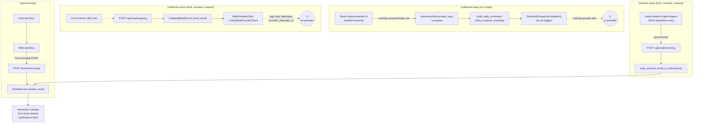
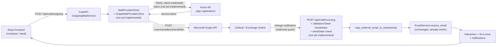

# Email Integration Analysis — Microsoft Graph

**Scope of this report:** a read-only inspection of the current email-integration code in `unified-backend/app/ticketing/`. No files were modified to produce this report.

**Headline finding:** There is **no working Microsoft Graph API integration** in this codebase today. What exists is a deliberately provider-agnostic *seam* — interfaces, schemas, and a mock implementation — built so that a real Graph client can be dropped in later "as a one-class change." Every Graph-specific piece (MSAL auth, Azure AD app registration, `sendMail` calls, webhook subscription validation) is explicitly **not implemented**, and this is stated directly in code comments, not just inferred.

---

## 1. How outgoing emails are sent

There are actually **two independent outbound paths**, and neither talks to Graph:

### a) The ticket-linked reply/compose path (older, in active use)
- `InteractionService.add_reply` / the compose flow (`unified-backend/app/ticketing/services/interaction_service.py`) builds an `OutboundEnvelope` via `build_reply_envelope` / `build_compose_envelope` (`services/email_envelope.py`).
- It hands that envelope to `OutboundDispatcher.dispatch()` (`services/outbound_dispatcher.py`).
- `OutboundDispatcher.dispatch()` is a **no-op logger** — nothing leaves the platform. The interaction is persisted with `dispatch_status = "QUEUED"` (see `interaction_service.py` lines ~681, 798, 934) regardless of whether anything was actually sent.

### b) The new standalone "mail provider" seam (newer, built ahead of credentials, not yet wired to the frontend)
- `POST /api/mail/outgoing` (`api/mail_integration.py`) accepts a frontend-authored `OutgoingEmailRequest` (`schemas/mail_integration.py`).
- `OutgoingMailService.send_email` (`services/outgoing_mail_service.py`) builds an `OutboundEnvelope` (reusing `build_compose_envelope` when `client_id` is given, so the "From is always the client's shared inbox" rule stays enforced in one place) and calls `MailProviderClient.send_email`.
- `get_mail_provider_client()` (`services/mail_provider.py`) currently always returns `MockMailProviderClient`, which **never makes a network call** — it just logs the envelope and fabricates a `MailProviderSendResult(status="SENT", provider_message_id=f"mock-{uuid4().hex}")`.
- The response literally says: `"Email dispatched successfully (mocked — Microsoft Graph integration pending)."`

**Neither path has any frontend caller for the new `/api/mail/outgoing` route** — a repo-wide search of `unified-frontend/src` found zero references to `api/mail`, `mail_integration`, or `OutgoingEmailRequest`. The existing reply/compose UI still goes through path (a) only.

## 2. How incoming emails are processed

Two transports converge on the same core logic:

- **Existing transport**: `POST /emails/incoming` (`api/email.py`) — flat form-encoded fields, fed today by an external **N8N** workflow (per code comments), unauthenticated by design.
- **New Graph-shaped transport**: `POST /api/mail/incoming` (`api/mail_integration.py`) — accepts a JSON body shaped like a real **Microsoft Graph `message` resource** (`IncomingMailPayload` in `schemas/mail_integration.py`, mirroring Graph's `emailAddress`/`recipient`/`itemBody`/`internetMessageHeaders` shapes almost field-for-field).
- `map_external_email_to_interaction()` (`services/mail_mapping_service.py`) translates that Graph-shaped payload into the existing internal `EmailRequest` schema — pulling `In-Reply-To`/`References` out of `internetMessageHeaders`, using `toRecipients[0]` as the shared-inbox address, etc.
- Both transports then hand off to the **same, unmodified** `EmailService.receive_email` (`services/email_service.py`), which does the real work: dedupe by `message_id`, resolve the owning client by inbox address, thread via `conversation_id` → `in_reply_to` → `references`, create the `Interaction`, start/resume the relevant SLA clock, write an `EMAIL_RECEIVED` audit event, and fire in-app notifications.

So `/api/mail/incoming` is **not a real Graph webhook** — it's a hand-authored JSON payload matching Graph's shape, meant to prove the mapping logic works before a real Graph subscription exists. The code says so explicitly (see §7/§8 below).

## 3. How Graph authentication works

**It doesn't — there is no authentication code for Graph anywhere in the repo.** Confirmed by an exhaustive search: no `msal` / `MSAL` import, no `ConfidentialClientApplication`, no `azure-identity` dependency, no client-credentials flow, no Azure AD app registration reference, no `graph.microsoft.com` URL anywhere in the codebase.

The intended (future, not built) design is described only in a comment block in `services/mail_provider.py`:

> "Replace this method's body (or swap this whole class for a `GraphMailProviderClient` implementing the same `MailProviderClient` interface) with a real call to `POST /users/{mailbox}/sendMail` via the Microsoft Graph SDK, authenticated through MSAL client-credentials flow once an Azure AD app registration and tenant credentials exist. **Do NOT implement that authentication yet** — this class must keep working as the default until credentials are available."

For inbound, `api/mail_integration.py`'s `receive_incoming_email` docstring is equally explicit:

> "a real Microsoft Graph webhook subscription requires validating a `validationToken` query param on the subscription handshake (echoed back as plain text) and checking `clientState` on every notification. **Neither is implemented yet** — this route only demonstrates accepting and mapping a Graph-shaped message body; don't point a live Graph subscription at it until that validation is added."

## 4. Files responsible for (future) Microsoft Graph integration

All under `unified-backend/app/ticketing/`:

| File | Role |
|---|---|
| `services/mail_provider.py` | The transport seam: `MailProviderClient` ABC, `MockMailProviderClient` (only implementation), `get_mail_provider_client()` factory (the single swap point for a future `GraphMailProviderClient`) |
| `services/outgoing_mail_service.py` | `OutgoingMailService` — builds the envelope, calls `MailProviderClient.send_email` |
| `services/mail_mapping_service.py` | `map_external_email_to_interaction()` — converts a Graph-shaped payload into the internal `EmailRequest` |
| `schemas/mail_integration.py` | `GraphEmailAddress`, `GraphRecipient`, `GraphItemBody`, `GraphInternetMessageHeader`, `IncomingMailPayload` (Graph `message`-resource mirror), `OutgoingEmailRequest`/`OutgoingEmailResponse` |
| `api/mail_integration.py` | Router: `POST /api/mail/outgoing`, `POST /api/mail/incoming` |
| `services/email_service.py` | Unmodified core inbound logic both transports converge on (`receive_email`) |
| `services/email_envelope.py` | `build_reply_envelope` / `build_compose_envelope` — shared envelope construction, reused by the new seam |
| `schemas/payloads.py` | `OutboundEnvelope` — the provider-agnostic outbound shape passed to `MailProviderClient` |
| `services/outbound_dispatcher.py` | The **older**, separate no-op outbound stub still used by the ticket reply/compose flow — not yet unified with the seam above |

Not present anywhere: a `GraphMailProviderClient`, an MSAL/Azure module, a Graph webhook-subscription manager.

## 5. Environment variables required

**For Microsoft Graph specifically: none exist.** The full `Settings` model in `unified-backend/app/core/config.py` was read in full — every field is listed below; nothing Graph/Azure/Outlook-related appears:

```
app_name, app_env, debug, api_v1_prefix, database_url,
jwt_secret_key, jwt_algorithm, access_token_expire_minutes, refresh_token_expire_days,
rbac_cache_ttl_seconds, rbac_cache_max_size,
sla_sweep_shared_secret, sla_sweep_interval_minutes,
cors_origins, secure_cookies, log_level,
storage_backend, storage_bucket, storage_url_expiry_seconds, storage_endpoint_url,
storage_access_key, storage_secret_key, storage_region, storage_use_ssl,
supabase_url, supabase_service_role_key,
smtp_host, smtp_port, smtp_username, smtp_password, smtp_from_email, smtp_use_tls,
app_frontend_url
```

The only email-transport env vars that exist at all are the plain-SMTP ones (`smtp_*`), and those back a completely separate feature (SLA-breach notification emails via `core/email_sender.py`) — unrelated to inbound/outbound ticket mail.

**What Graph would need, once built** (not present, inferred purely from the standard Graph client-credentials pattern the code comments point at — for context only, not implemented): a tenant ID, client ID, client secret for an Azure AD app registration, the target mailbox/shared-inbox UPN, and a webhook `clientState` secret for subscription validation.

## 6. Endpoints that already exist

| Method & Path | File | Auth | Purpose |
|---|---|---|---|
| `POST /emails/incoming` | `api/email.py` | None (service-to-service) | Real inbound transport, form-encoded, fed by N8N today |
| `POST /emails/dummy` | `api/email.py` | Site Lead Bearer token | Simulates inbound mail via the same `EmailService.receive_email`, for testing |
| `POST /api/mail/outgoing` | `api/mail_integration.py` | Authenticated agent | Sends via `MailProviderClient` (mock only) |
| `POST /api/mail/incoming` | `api/mail_integration.py` | None (service-to-service) | Accepts a Graph-shaped JSON payload, maps it, reuses `EmailService.receive_email` |

No route exists yet for a Graph webhook **subscription lifecycle** (create/renew/validate a subscription) — only the notification-payload-shaped receiving side is stubbed.

## 7. Which parts are complete

- The **provider-agnostic abstraction layer** is fully built and internally consistent: `MailProviderClient` interface, envelope schema (`OutboundEnvelope`), and a working mock (`MockMailProviderClient`) that lets the rest of the system (routes, services, response schemas) be exercised end-to-end today.
- The **inbound mapping layer** for Graph-shaped JSON (`IncomingMailPayload` → `EmailRequest`) is complete and functional — it correctly extracts `In-Reply-To`/`References` from `internetMessageHeaders`, resolves the shared inbox from `toRecipients[0]`, and reuses the same threading/client-resolution/SLA/notification logic the existing N8N transport already relies on.
- The **outgoing request/response schema and route** (`POST /api/mail/outgoing`) are complete and testable against the mock.
- The **core Interaction-creation pipeline** (`EmailService.receive_email`) both transports converge on is real, complete, and already in production use via the N8N path.

## 8. Which parts are still missing

- **No real Graph client.** No `GraphMailProviderClient`, no Graph SDK dependency, no actual `POST /users/{mailbox}/sendMail` call.
- **No Graph authentication.** No MSAL, no Azure AD app registration, no client-credentials token acquisition/caching/refresh.
- **No webhook subscription lifecycle.** No code to create/renew a Graph change-notification subscription, and — explicitly flagged in the code — no `validationToken` handshake handling and no `clientState` verification on `POST /api/mail/incoming`. The docstring itself warns not to point a real Graph subscription at this route until that's added.
- **No environment/config surface for Graph** (tenant ID, client ID/secret, mailbox UPN, webhook secret) — none of these fields exist in `Settings` yet.
- **No frontend wiring** to the new `/api/mail/outgoing` endpoint — the compose/reply UI still uses the older `OutboundDispatcher`-backed flow exclusively.
- **Two outbound stubs, not unified.** The older `OutboundDispatcher` (ticket reply/compose) and the newer `MailProviderClient` seam (`/api/mail/outgoing`) are separate, parallel no-op implementations — a future Graph integration would need to decide whether both get unified onto one provider client or remain deliberately separate.
- **No error/retry/rate-limit handling** for a real provider — the mock always succeeds, so none of that has been designed yet.

## 9. Complete flow: React → FastAPI → Microsoft Graph → Outlook → back

### Current actual state (mock/N8N, no Graph)



### Intended future state (once Graph credentials + auth exist — NOT built)



**Reading the diagrams together**: the *right-hand* side of both diagrams — everything from `EmailService.receive_email` onward — is real and shared by every transport, past, present, and future. The *left-hand* side (the actual wire connection to Outlook/Graph) is where all the missing pieces from §8 live: today that gap is filled by N8N (inbound) and nothing at all (outbound, mocked); in the intended future state it would be filled by a real `GraphMailProviderClient` plus MSAL authentication and a validated webhook subscription — none of which currently exist in this repository.
