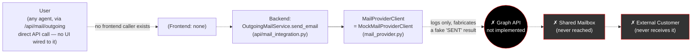
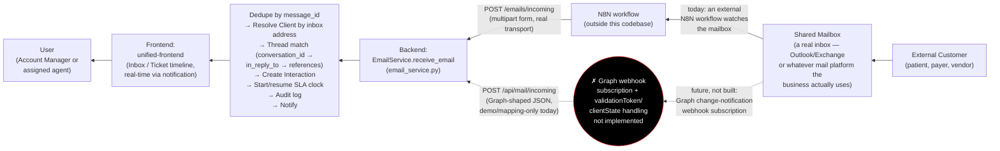

# End-to-End Email Flow

Full-project verification of the email workflow, synthesizing direct source inspection across `unified-frontend`, `unified-backend`, and every prior report in this series (`EMAIL_INTEGRATION_ANALYSIS.md`, `EMAIL_INTEGRATION_CHECKLIST.md`, `EMAIL_ENVIRONMENT_GUIDE.md`, `EMAIL_API_DOCUMENTATION.md`, `GRAPH_AUTHENTICATION.md`, `EMAIL_SEND_FLOW.md`, `EMAIL_RECEIVE_FLOW.md`, `AZURE_SETUP_GUIDE.md`). No project files were modified to produce this document.

## Headline: the requested chain has a real gap in the middle

You asked for User → Frontend → Backend → Graph API → Shared Mailbox → External Customer. Verified against the actual code: **every link exists and works except the Backend → Graph API → Shared Mailbox segment**, which is currently a mock/no-op standing in for that missing piece. The diagrams below show the chain exactly as it exists today, with the missing segment marked explicitly rather than glossed over.

---

## Outgoing flow (User composes/replies → external customer)

```mermaid
flowchart LR
    U["User\n(agent, in unified-frontend)"] -->|"types a reply/compose\nin the Mail UI"| F["Frontend\nunified-frontend/src/ticket-workspace\n(@tw/api/inbox.ts)"]
    F -->|"POST /inbox/compose\nPOST /inbox/{id}/reply\nPUT /inbox/{id}/draft (autosave)"| B1["Backend:\nInteractionService\n(add_reply / compose_email / send_draft)"]
    B1 --> B2["build_reply_envelope /\nbuild_compose_envelope\n(email_envelope.py)"]
    B2 --> B3["OutboundDispatcher.dispatch()\n(outbound_dispatcher.py)"]
    B3 -.->|"NO-OP — logs only.\nNothing sent."| GAP(("✗ Graph API\nnot implemented"))
    GAP -.-> SM["✗ Shared Mailbox\n(never reached)"]
    SM -.-> EC["✗ External Customer\n(never receives it)"]

    style GAP fill:#000,color:#fff,stroke:#f00
    style SM fill:#333,color:#fff,stroke:#f00
    style EC fill:#333,color:#fff,stroke:#f00
```

### Step-by-step (the real, working part: User → Frontend → Backend)

1. **User** — an agent (Staff/Team Lead/Account Manager/etc.) opens a ticket's Mail thread or the standalone Inbox in `unified-frontend`'s embedded ticket workspace, types a reply or composes a new message, optionally attaching files. Drafts auto-save as they type (debounced).
2. **Frontend** — `unified-frontend/src/ticket-workspace/api/inbox.ts` calls, verified directly against the file: `POST /inbox/compose` (new message), `POST /inbox/{interaction_id}/reply` (reply on a bare, not-yet-ticketed thread), `PUT /inbox/{interaction_id}/draft` (autosave), `POST /inbox/{interaction_id}/draft/attachments`, `DELETE /inbox/{interaction_id}/draft` (discard). Ticket-linked replies go through the ticket detail page's own reply action, backed by `POST /tickets/{id}/reply` → `InteractionService.add_reply`.
3. **Backend** — `InteractionService` (`add_reply`/`add_interaction_reply`/`compose_email`/`send_draft`) resolves the thread, builds an `OutboundEnvelope` via `build_reply_envelope`/`build_compose_envelope` (enforcing "From is always the client's shared inbox," `Re:` subject prefixing, Account-Manager auto-Cc — see `EMAIL_SEND_FLOW.md` §4), persists the interaction with `dispatch_status = "QUEUED"`, writes an audit log entry, and calls `OutboundDispatcher.dispatch()`.
4. **The gap** — `OutboundDispatcher.dispatch()` (`services/outbound_dispatcher.py`) is a **pure no-op**: it logs `"queued outbound email: ..."` and returns. Nothing is transmitted. `dispatch_status` stays `"QUEUED"` forever; there is no code path that ever sets it to `SENT` or `FAILED`, because no real transport exists to report either outcome.
5. **Graph API / Shared Mailbox / External Customer** — none of these are ever reached on this path. A second, parallel seam (`POST /api/mail/outgoing` → `OutgoingMailService` → `MockMailProviderClient`) exists specifically to exercise what a real Graph call *would* look like, but it isn't wired to any frontend button, and its own mock also never calls Graph — it fabricates a `"SENT"` result and logs the envelope, nothing more (see `EMAIL_API_DOCUMENTATION.md` §1, `EMAIL_SEND_FLOW.md`).

**What would need to change for the full chain to work**: `services/mail_provider.py`'s `get_mail_provider_client()` factory would need to return a real `GraphMailProviderClient` (implementing MSAL client-credentials auth and a real `POST /users/{mailbox}/sendMail` call) instead of `MockMailProviderClient` — and, per `EMAIL_INTEGRATION_CHECKLIST.md`, a decision on whether `OutboundDispatcher` (the path real UI traffic uses) gets unified onto that same client, since today the two stubs are entirely separate.

---

## Incoming flow (external customer → shared mailbox → user)

This is the direction that matters most in an RCM ticketing system — a client/payer/vendor emailing in, needing to land as a ticket. Verified against `unified-backend/app/ticketing/services/email_service.py` (read in full) and both inbound routes.

### Step-by-step

1. **External Customer** — a patient, insurance payer, referring provider, or vendor sends an email to the practice's shared inbox address (matches `Client.inbox_email` in this system's data model).
2. **Shared Mailbox** — the real inbox where that mail actually lands (Outlook/Exchange or whatever platform is in production use). This mailbox itself is external to this codebase — nothing here manages it directly today.
3. **Transport into the backend — two real paths, verified against the routes**:
   - **Today's real, production path**: an **N8N workflow** (external to this codebase) watches the mailbox and forwards each new message as an HTTP POST to `POST /emails/incoming` (`api/email.py`) — flat multipart form fields, deliberately unauthenticated (service-to-service). This is the transport actually in use.
   - **The Graph-shaped sibling, not a real subscription**: `POST /api/mail/incoming` (`api/mail_integration.py`) accepts a JSON body shaped like a Graph `message` resource and maps it via `map_external_email_to_interaction()` into the same internal shape. This route is unauthenticated too, but **does not have a real Graph webhook subscription feeding it** — no `validationToken` handshake, no `clientState` verification exist (confirmed directly in the route's own docstring and in `EMAIL_RECEIVE_FLOW.md` §1). It exists to prove the mapping logic works, not as a live receiver.
4. **Backend — `EmailService.receive_email`** (identical for both transports): checks `message_id` for a duplicate (`409` if already processed) → resolves the owning `Client` by the shared inbox address the mail arrived at, never by sender → checks for an existing thread in strict priority order (`conversation_id` → `in_reply_to` → `references`) → creates an `Interaction` row (new pending inbox item, or joins an existing ticket's timeline if the thread match resolves to one) → starts a First Response SLA clock (new thread) or resumes a paused Resolution SLA clock (reply on an existing ticket) → writes an `EMAIL_RECEIVED` audit event → fires an in-app notification to the right audience (the client's Account Manager + global-inbox roles for a new item; the ticket's assigned agent + their Team Lead for a reply on an existing ticket) → stores any attachments sent in the same request (form-encoded transport only — the Graph-shaped route has no attachment handling at all, a real gap, see `EMAIL_RECEIVE_FLOW.md` §5).
5. **Frontend** — the Account Manager's or assigned agent's Inbox/ticket-timeline view in `unified-frontend` reflects the new interaction once they load or refresh that view; the in-app notification (bell icon) surfaces it immediately if they're already in the app.
6. **User** — the human on the receiving end reads the message and can reply (re-entering the **outgoing** flow above), or work the resulting ticket.

**What's real vs. missing here, precisely**: steps 4–6 are fully real, in production use, and don't depend on Graph at all. Step 3's N8N path is real and working. Step 3's Graph-shaped path exists in code but has no live Graph subscription behind it, and couldn't safely accept one yet (no request-authenticity verification) even if one were created.

---

## Consolidated verification summary

| Segment of the requested chain | Status | Evidence |
|---|---|---|
| User → Frontend | **Real, working** | `@tw/api/inbox.ts` calls confirmed against source |
| Frontend → Backend | **Real, working** | `/inbox/compose`, `/inbox/{id}/reply`, `/tickets/{id}/reply`, `/inbox/{id}/draft` all real routes backed by `InteractionService` |
| Backend → Graph API (outgoing) | **Missing — mocked** | `OutboundDispatcher.dispatch()` and `MockMailProviderClient.send_email()` both no-ops; no MSAL, no Graph SDK call anywhere (`GRAPH_AUTHENTICATION.md`) |
| Graph API → Shared Mailbox → External Customer | **Never reached** | Nothing to send, since nothing before it actually transmits |
| External Customer → Shared Mailbox | **Real mailbox, external to this codebase** | Not managed by this repo |
| Shared Mailbox → Backend (inbound) | **Real, working — via N8N, not Graph** | `POST /emails/incoming`, fed by an external N8N workflow per code comments |
| Shared Mailbox → Backend (inbound, Graph path) | **Code exists, no live subscription, unsafe to connect one yet** | `POST /api/mail/incoming` has no `validationToken`/`clientState` handling |
| Backend → Frontend → User (inbound) | **Real, working** | `EmailService.receive_email`'s notification fan-out, confirmed in full against source |

Net: the **shape** of a Graph integration — a swappable provider client, Graph-mirrored schemas, a mapping layer — is fully scaffolded and everything on either side of it works. The actual Graph connection itself (authentication, real send/receive calls, webhook validation) is the one piece that doesn't exist, consistent with every prior report in this series. See `EMAIL_INTEGRATION_CHECKLIST.md` for the full build-out list and `AZURE_SETUP_GUIDE.md` for the infrastructure prerequisites once that work begins.
