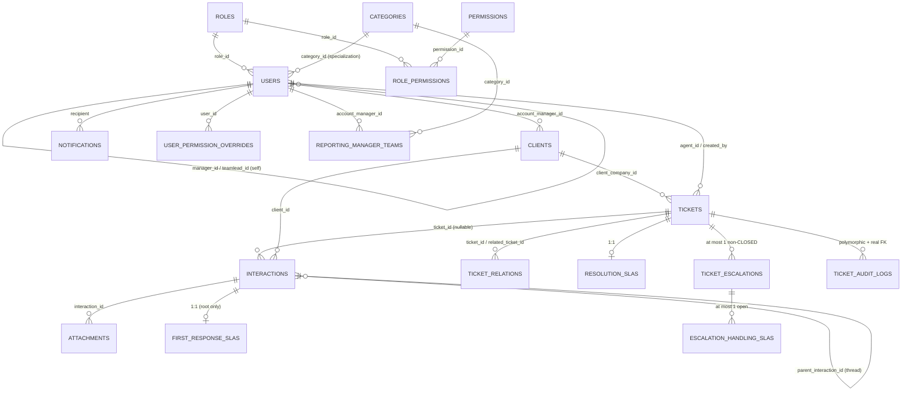

# Ticketing System — Technical Schema Reference for ML Recommendation System (Phase 1)

Generated from a direct, code-verified read of the live monorepo (`unified-backend/`, `shared_models/`) — models, migrations, enums, services, schemas. Not derived from documentation or assumptions. Where the current implementation has a real gap, drift, or bug, it is called out explicitly rather than smoothed over, per the request to describe the system exactly as it exists.

---

## Read this first — load-bearing facts that affect synthetic data design

1. **Every ticket in this system originates from a pre-existing `Interaction` row.** There is no "create a blank ticket" API path in use — `TicketService.create()` exists in code but is never called from any route. The only real creation path is `InboxTicketService.create_ticket_from_interaction`, which requires an existing EMAIL interaction. **Your synthetic generator must always produce Interaction → Ticket in that order, paired.**
2. **`Ticket.ticket_type` (the "category" field) is a plain `String(50)` with no foreign key to `categories`.** There is no DB-level or schema-level constraint tying it to the real `CategoryName` enum values — only the frontend dropdown enforces this today. Nothing stops a row from having an arbitrary string here. For clean synthetic data, generate it from the real 7 `CategoryName` values anyway (see §5), but know the DB itself won't reject anything else.
3. **`alembic_ticketing` currently has two unmerged migration heads** (`e4b6d8f0a2c5` and `f3a5c7e9b1d4`, both branching off `d2a4c6e8f0b3`), and the live model file `sla_breach_notification.py` has a duplicate `cycle` column definition as a direct artifact of this (the second definition wins — see §1 Tables). This doesn't block reading/writing data today but is worth knowing before assuming the migration chain is linear.
4. **No ML/embedding/vector/recommendation/feedback infrastructure exists anywhere in this codebase today.** No pgvector, no embedding columns, no feedback/rating tables, no recommendation-logging tables. The only vaguely "recommendation"-shaped code is a deterministic (non-ML) thread-matching heuristic in `open_email_service.py` — see §11.
5. **Two separate `Category` concepts do NOT exist** — there is one `categories` table (RBAC-owned, `shared_models`), read-only from the ticketing side. `IssueType` as a named concept does not exist in the codebase at all; category (`CategoryName`) is the only classification axis on a ticket.

---

## 1. Database Schema

Two independent Alembic chains write to one physical Postgres database: `alembic_rbac` (users/roles/permissions/categories) and `alembic_ticketing` (tickets/interactions/SLA/escalation). Tables below are grouped by owning chain.

### 1.A — RBAC domain (`alembic_rbac`)

#### `users`
*Model: `shared_models/shared_models/models/user.py`. Purpose: the single cross-cutting identity record shared by both domains — auth, org-chart, work-specialization category, and self-service profile data.*

| Column | Type | Null | Default | Notes |
|---|---|---|---|---|
| `user_id` | UUID | N | `uuid4()` | **PK** |
| `name` | String(100) | N | — | |
| `email` | String(255) | N | — | **Unique**, indexed |
| `password_hash` | String(255) | N | — | (not `hashed_password`) |
| `role_id` | UUID | N | — | **FK** → `roles.role_id` |
| `manager_id` | UUID | Y | — | **FK (self)** → `users.user_id` |
| `teamlead_id` | UUID | Y | — | **FK (self)** → `users.user_id` |
| `category_id` | UUID | Y | — | **FK** → `categories.category_id` |
| `is_active` | Boolean | N | `True` | |
| `permission_version` | Integer | N | `1` (server_default too) | cache-busting counter |
| `date_of_birth` | Date | Y | — | |
| `alternate_email` | String(255) | Y | — | |
| `phone_number` | String(30) | Y | — | |
| `office_location` | String(255) | Y | — | |
| `department` | String(100) | Y | — | one-time backfilled from category name |
| `team` | String(100) | Y | — | display-only |
| `language` | String(10) | Y | `server_default='en'` | |
| `date_format` | String(20) | Y | `server_default='MM/DD/YYYY'` | |
| `time_format` | String(10) | Y | `server_default='12h'` | |
| `time_zone` | String(50) | Y | — | |
| `default_dashboard` | String(50) | Y | `server_default='Dashboard'` | |
| `created_at` / `updated_at` | DateTime(tz) | N | now() | |

No `ondelete` on any of the 4 FKs (deliberate, app-enforced).

#### `roles`
*Model: `shared_models/shared_models/models/role.py`. Purpose: the role a user holds.*

| Column | Type | Null | Default | Notes |
|---|---|---|---|---|
| `role_id` | UUID | N | `uuid4()` | **PK** |
| `name` | String(100) | N | — | **Unique** |

**No `rank`/`level`/`description` column exists.** The hierarchy (Super Admin > Site Lead > Account Manager > Team Lead > Staff; Viewer outside it) is implicit in application code only, never a DB value. Current seeded role names: `Super Admin`, `Site Lead`, `Account Manager`, `Team Lead`, `Staff`, `Viewer`. "Account Manager" is a true in-place rename of an older "Manager" role (same `role_id`), done idempotently by the seed script, not a migration.

#### `categories`
*Model: `shared_models/shared_models/models/category.py`. Purpose: the fixed work-specialization/ticket-category lookup.*

| Column | Type | Null | Default | Notes |
|---|---|---|---|---|
| `category_id` | UUID | N | `uuid4()` | **PK** |
| `category_name` | native enum `category_name_enum` | N | — | **Unique** |

7 fixed rows (seeded with fixed UUIDs) — see §5 for values. No timestamps on this table.

#### `permissions`
| Column | Type | Null | Default | Notes |
|---|---|---|---|---|
| `permission_id` | UUID | N | `uuid4()` | **PK** |
| `permission_name` | String(100) | N | — | **Unique**, e.g. `"ticket:create"` |
| `description` | Text | Y | — | |
| `created_at` | DateTime(tz) | N | app-side now() | |

#### `role_permissions`
Pure join table. **Composite PK** `(role_id, permission_id)`, both `ondelete="CASCADE"`. No extra columns.

#### `audit_logs` (RBAC-native — distinct from ticketing's `ticket_audit_logs`)
| Column | Type | Null | Default | Notes |
|---|---|---|---|---|
| `audit_log_id` | UUID | N | `uuid4()` | **PK** |
| `user_id` | UUID | Y | — | **FK** → `users`, `ondelete=SET NULL` |
| `action` | String(100) | N | — | indexed, free string e.g. `"auth.login"` |
| `entity_type` | String(100) | N | — | indexed, free string |
| `entity_id` | String(100) | Y | — | plain string, no FK |
| `old_value` / `new_value` | Text | Y | — | |
| `ip_address` | String(50) | Y | — | |
| `user_agent` | String(500) | Y | — | |
| `timestamp` | DateTime(tz) | N | app-side now() | indexed |

#### `user_permission_overrides`
| Column | Type | Null | Default | Notes |
|---|---|---|---|---|
| `override_id` | UUID | N | `uuid4()` | **PK** |
| `user_id` | UUID | N | — | **FK** → `users`, CASCADE |
| `permission_id` | UUID | N | — | **FK** → `permissions`, CASCADE |
| `granted_by` | UUID | Y | — | **FK** → `users`, SET NULL |
| `reason` | Text | Y | — | |
| `granted_at` | DateTime(tz) | N | app-side now() | |
| `expires_at` | DateTime(tz) | Y | — | blank = permanent |
| `revoked_at` / `revoked_by` | DateTime(tz)/UUID | Y | — | soft-revoke, never deleted |
| `scope_ticket_id` | UUID | Y | — | plain UUID, **no FK** (cross-chain) |

Partial unique index: `(user_id, permission_id, COALESCE(scope_ticket_id, '00000000-0000-0000-0000-000000000000'::uuid))  WHERE revoked_at IS NULL` — at most one active grant per user+permission+scope.

#### `permission_requests`
| Column | Type | Null | Default | Notes |
|---|---|---|---|---|
| `request_id` | UUID | N | `uuid4()` | **PK** |
| `requester_id` | UUID | N | — | **FK** → `users`, CASCADE |
| `permission_id` | UUID | N | — | **FK** → `permissions`, CASCADE |
| `requested_role` | String(100) | N | — | immutable display snapshot only |
| `selected_approver_id` | UUID | Y | — | **FK** → `users`, SET NULL — real routing key |
| `reason` | Text | N | — | |
| `scope_ticket_id` | UUID | Y | — | no FK |
| `status` | String(20) | N | `"PENDING"` | plain string; `PENDING/APPROVED/REJECTED/REVOKED` |
| `reviewed_by` / `reviewed_at` / `review_comment` | UUID/DateTime/Text | Y | — | |
| `expires_at` | DateTime(tz) | Y | — | |
| `granted_override_id` | UUID | Y | — | **FK** → `user_permission_overrides`, SET NULL |
| `revoked_by` / `revoked_at` / `revoke_reason` | UUID/DateTime/Text | Y | — | |
| `created_at` | DateTime(tz) | N | app-side now() | |

Partial unique index: `(requester_id, permission_id, COALESCE(scope_ticket_id, sentinel)) WHERE status='PENDING'`.

#### `reporting_manager_teams`
| Column | Type | Null | Default | Notes |
|---|---|---|---|---|
| `id` | UUID | N | `uuid4()` | **PK** |
| `account_manager_id` | UUID | N | — | **FK** → `users`, CASCADE |
| `category_id` | UUID | N | — | **FK** → `categories`, CASCADE |
| `assigned_by` | UUID | Y | — | **FK** → `users`, SET NULL |
| `assigned_at` | DateTime(tz) | N | app-side now() | |

Unique constraint on `(account_manager_id, category_id)` pair only — **no** uniqueness on `category_id` alone; a category can have several Reporting Managers.

---

### 1.B — Ticketing domain (`alembic_ticketing`)

#### `tickets`
*Model: `unified-backend/app/ticketing/models/ticket.py`. Purpose: the core work item.*

| Column | Type | Null | Default | Notes |
|---|---|---|---|---|
| `ticket_id` | UUID | N | `uuid4()` | **PK** |
| `client_id` | UUID | Y | — | **FK** → `users` — **legacy, always NULL for new tickets, do not write to it** |
| `client_company_id` | UUID | Y | — | **FK** → `clients.client_id`, indexed — the real client-ownership column |
| `agent_id` | UUID | Y | — | **FK** → `users`, indexed — currently working it |
| `created_by` | UUID | Y | — | **FK** → `users` |
| `title` | String(255) | N | — | GIN trigram index (DB-only, not in ORM `index=True`) |
| `ticket_type` | String(50) | N | — | indexed; **no FK to `categories`** (see load-bearing fact #2) |
| `current_status` | enum `ticket_status_enum` | N | `OPEN` | indexed |
| `current_priority` | enum `ticket_priority_enum` | N | `MEDIUM` | indexed; `CRITICAL` is system-set only |
| `custom_fields` | JSONB | N | `{}` | |
| `version` | Integer | N | `1` | optimistic concurrency |
| `closed_at` / `closed_by` | DateTime(tz)/UUID | Y | — | **FK** (closed_by) → `users` |
| `created_at` | DateTime(tz) | N | now() | indexed |
| `updated_at` | DateTime(tz) | N | now()/onupdate | DB-only index |

**DB-only indexes** (not declared on the model, only via raw migration SQL): `ix_tickets_pool_view` (partial, `WHERE agent_id IS NULL AND current_status='OPEN'`), `ix_tickets_title_trgm` (GIN trigram), `ix_tickets_updated_at`.

**Fields that look like ticket columns but are query-time computed, never stored**: `is_escalated`, `escalation_level`, `escalation_status`, `escalation_ack_due_at`, `is_escalation_owner`, `escalation_pending_acceptance`, `resolution_sla_tier`, `client_name`, `client_company_name`, `agent_name`, `created_by_name`, `closed_by_name`, `related_tickets`. **Do not model these as real columns in synthetic data — derive them the same way the app does, from joins.**

#### `interactions`
*Model: `unified-backend/app/ticketing/models/interaction.py`. Purpose: the unified timeline row for every email, reply, note, and attachment event — pre-ticket and post-ticket alike.*

| Column | Type | Null | Default | Notes |
|---|---|---|---|---|
| `interaction_id` | UUID | N | `uuid4()` | **PK** |
| `ticket_id` | UUID | **Y** | — | **FK** → `tickets`, indexed. NULL while unticketed |
| `interaction_type` | String(50) | N | — | **plain string, not a Postgres enum** — see §5 |
| `status` | enum `interaction_status_enum` | N | `PENDING` | `PENDING/ASSIGNED/IGNORED` |
| `direction` | enum `interaction_direction_enum` | N | — | `INBOUND/OUTBOUND/INTERNAL` |
| `performed_by` | UUID | Y | — | **FK** → `users`; NULL for inbound email |
| `payload` | JSONB | N | `{}` | shape varies by type — see §4 |
| `subject` | String(500) | Y | — | GIN trigram index; NULL for ATTACHMENT rows |
| `is_visible` | Boolean | N | `True` | soft-delete flag |
| `removed_by` / `removed_at` | UUID/DateTime(tz) | Y | — | **FK** (removed_by) → `users` |
| `claimed_by` / `claimed_at` | UUID/DateTime(tz) | Y | — | **FK** (claimed_by) → `users` |
| `tags` | JSONB (list) | N | `[]` | |
| `folder_id` | UUID | Y | — | **FK** → `mail_folders.folder_id` |
| `is_draft` | Boolean | N | `False` | |
| `message_id` | String(255) | Y | — | **Unique** — RFC 5322 Message-ID |
| `client_id` | UUID | Y | — | **FK** → `clients` |
| `parent_interaction_id` | UUID | Y | — | **FK (self)** → `interactions`; NULL = thread root |
| `received_at` | DateTime(tz) | Y | — | SLA clock start; NULL for replies/notes |
| `conversation_id` | String(255) | Y | — | Microsoft Graph thread id |
| `in_reply_to_message_id` | String(255) | Y | — | |
| `references` | JSONB (list) | Y | — | |
| `created_at` | DateTime(tz) | N | now() | |

**Unique partial index**: `ix_interactions_one_draft_per_thread_per_agent` on `(parent_interaction_id, performed_by) WHERE is_draft AND is_visible` — one active draft per thread per agent, enforced in Postgres itself.

**Removed column, do not include**: `snoozed_until` — added then later dropped entirely (Snooze feature removed).

#### `attachments`
*Model: `unified-backend/app/ticketing/models/attachment.py`.*

| Column | Type | Null | Default | Notes |
|---|---|---|---|---|
| `attachment_id` | UUID | N | `uuid4()` | **PK** |
| `interaction_id` | UUID | **N** | — | **FK** → `interactions` — **confirmed: keyed on interaction, not ticket, and has no index at all** |
| `filename` | String(255) | N | — | |
| `mime_type` | String(100) | Y | — | |
| `size_bytes` | BigInteger | Y | — | app-enforced max 25 MB, max 10 files/upload |
| `storage_key` | Text | N | — | |
| `bucket_name` | String(255) | Y | — | |
| `scan_status` | String(20) | N | `"pending"` | file-type/size only — **no actual malware scan exists today** |
| `uploaded_at` | DateTime(tz) | N | now() | |
| `created_at` / `updated_at` | DateTime(tz) | Y | now() | |

#### `clients`
*Model: `unified-backend/app/ticketing/models/client.py`. Purpose: a client company, not an individual.*

| Column | Type | Null | Default | Notes |
|---|---|---|---|---|
| `client_id` | UUID | N | `uuid4()` | **PK** |
| `name` | String(255) | N | — | |
| `inbox_email` | String(255) | N | — | **Unique**, always lowercased |
| `account_manager_id` | UUID | N | — | **FK** → `users`, indexed |
| `is_active` | Boolean | N | `True` | |
| `created_at` / `updated_at` | DateTime(tz) | N | now() | |

#### `ticket_relations`
Symmetric "Related Tickets" link (one relationship = two mirrored rows). **Composite PK** `(ticket_id, related_ticket_id)`, both **FK** → `tickets.ticket_id`. Plus `created_at`.

#### `ticket_audit_logs`
*Model: `unified-backend/app/ticketing/models/audit_log.py`. Purpose: immutable ticket-domain compliance trail.*

| Column | Type | Null | Default | Notes |
|---|---|---|---|---|
| `audit_id` | UUID | N | `uuid4()` | **PK** |
| `entity_type` | enum `audit_entity_type_enum` | N | — | `TICKET/INTERACTION/ATTACHMENT/CLIENT/USER` |
| `entity_id` | UUID | N | — | polymorphic, no FK |
| `event_type` | enum `audit_event_type_enum` | N | — | 34 values — see §5 |
| `actor_id` | UUID | Y | — | **FK** → `users` |
| `actor_name` | String(255) | N | — | stored at write time, durable |
| `actor_role` | enum `audit_actor_role_enum` | N | — | `AGENT/CLIENT/SYSTEM` |
| `old_values` / `new_values` | JSONB | Y | — | |
| `ticket_id` | UUID | Y | — | **FK** → `tickets`, derived at write time |
| `created_at` | DateTime(tz) | N | now() | |

Indexes: `(entity_type, entity_id, created_at DESC)`, `(actor_id, created_at DESC)`, `(event_type, created_at DESC)`, `(ticket_id, created_at DESC)`.

#### `resolution_slas`
*1:1 clock per Ticket.*

| Column | Type | Null | Default | Notes |
|---|---|---|---|---|
| `resolution_sla_id` | UUID | N | `uuid4()` | **PK** |
| `ticket_id` | UUID | N | — | **FK** → `tickets`, **unique**, indexed |
| `client_id` | UUID | Y | — | **FK** → `clients`, denormalized |
| `priority` | enum `ticket_priority_enum` | N | — | snapshot at creation |
| `status` | enum `sla_clock_status_enum` | N | `RUNNING` | indexed |
| `started_at` / `due_at` | DateTime(tz) | N | — | `due_at` indexed |
| `active_target_minutes` | Integer | N | — | current real target |
| `paused_at` | DateTime(tz) | Y | — | non-null iff PAUSED |
| `total_paused_seconds` | Integer | N | `0` | |
| `completed_at` | DateTime(tz) | Y | — | |
| `escalation_cycle` | Integer | N | `0` (see caveat below) | bumped on each handling-stage restart |
| `created_at` / `updated_at` | DateTime(tz) | N | now() | |

Index `(status, due_at)` — the sweep's primary query. **Caveat**: `escalation_cycle`'s `server_default` differs depending on which of the two divergent migration heads (see load-bearing fact #3) was actually applied to a given database — treat it as `NOT NULL DEFAULT 0` for synthetic generation regardless.

#### `first_response_slas`
*1:1 clock per thread-root Interaction. No `updated_at` column (asymmetric with ResolutionSLA).*

| Column | Type | Null | Default | Notes |
|---|---|---|---|---|
| `first_response_sla_id` | UUID | N | `uuid4()` | **PK** |
| `interaction_id` | UUID | N | — | **FK** → `interactions`, **unique**, indexed |
| `client_id` | UUID | Y | — | **FK** → `clients` |
| `priority` | enum `ticket_priority_enum` | N | — | defaults MEDIUM for pre-ticket items |
| `status` | enum `sla_clock_status_enum` | N | `PENDING` | only PENDING/COMPLETED used in practice |
| `started_at` / `due_at` | DateTime(tz) | N | — | `due_at` indexed |
| `completed_at` | DateTime(tz) | Y | — | |
| `completion_reason` | String(30) | Y | — | free string: `ARCHIVED/REPLIED/ATTACHED_TO_TICKET/TICKET_CREATED` |
| `resulting_ticket_id` | UUID | Y | — | **FK** → `tickets` |
| `created_at` | DateTime(tz) | N | now() | |

#### `ticket_escalations`
*At most one non-CLOSED row per ticket, enforced by a partial unique index.*

| Column | Type | Null | Default | Notes |
|---|---|---|---|---|
| `escalation_id` | UUID | N | `uuid4()` | **PK** |
| `ticket_id` | UUID | N | — | **FK** → `tickets`, indexed |
| `resolution_sla_id` | UUID | Y | — | **FK** → `resolution_slas`, read-only link |
| `level` | enum `ticket_escalation_level_enum` | N | — | `TEAM_LEAD/MANAGER/SITE_LEAD` |
| `status` | enum `ticket_escalation_status_enum` | N | `ACTIVE` | `ACTIVE/ACKNOWLEDGED/CLOSED` |
| `owner_ids` | JSONB (list of user_id strings) | N | `[]` | wholesale-replaced on advance |
| `original_priority` | enum `ticket_priority_enum` | N | — | snapshot pre-CRITICAL-bump |
| `has_advanced_past_starting_level` | Boolean | N | `False` | |
| `handling_stage` | Integer | N | `0` | # completed accept→assign→breach cycles |
| `handling_stage_started_at` / `handling_stage_due_at` | DateTime(tz) | Y | — | non-null iff a stage is running |
| `triggered_by` | String(20) | N | — | `MANUAL` or `AUTO_SLA_BREACH` (free string) |
| `triggered_by_user_id` | UUID | Y | — | **FK** → `users` |
| `created_at` / `level_started_at` | DateTime(tz) | N | now() | |
| `ack_due_at` | DateTime(tz) | N | — | indexed |
| `acknowledged_at` / `acknowledged_by` | DateTime(tz)/UUID | Y | — | **FK** (acknowledged_by) → `users` |
| `closed_at` / `closed_reason` | DateTime(tz)/String(30) | Y | — | reason: `TICKET_RESOLVED`/`MANUALLY_CLOSED` |
| `updated_at` | DateTime(tz) | N | now()/onupdate | |

Indexes: `(status, ack_due_at)`; partial `handling_stage_due_at WHERE NOT NULL`; **unique partial** `ix_ticket_escalations_one_active_per_ticket` on `ticket_id WHERE status != 'CLOSED'`.

#### `escalation_handling_slas`
*Second internal clock, target = a fixed % of the original Resolution SLA target. Multiple rows per escalation allowed over time; at most one "open" at once.*

| Column | Type | Null | Default | Notes |
|---|---|---|---|---|
| `escalation_handling_sla_id` | UUID | N | `uuid4()` | **PK** |
| `escalation_id` | UUID | N | — | **FK** → `ticket_escalations`, indexed (non-unique) |
| `ticket_id` | UUID | N | — | **FK** → `tickets`, indexed |
| `status` | enum `sla_clock_status_enum` | N | `RUNNING` | only RUNNING/COMPLETED used |
| `target_seconds` | Integer | N | — | |
| `started_at` / `due_at` | DateTime(tz) | N | — | `due_at` indexed |
| `breached_at` / `completed_at` | DateTime(tz) | Y | — | breached_at stamped once |
| `created_at` | DateTime(tz) | N | now() | |

Unique partial index: `escalation_id WHERE breached_at IS NULL AND completed_at IS NULL`.

#### `sla_policies`
*One row per `TicketPriority`. No FKs — standalone lookup, seeded not app-created.*

| Column | Type | Null | Default | Notes |
|---|---|---|---|---|
| `policy_id` | UUID | N | `uuid4()` | **PK** |
| `priority` | enum `ticket_priority_enum` | N | — | **unique** |
| `first_response_target_minutes` | Integer | N | — | |
| `resolution_target_minutes` | Integer | N | — | |
| `escalation_ack_target_minutes` | Integer | N | — | |
| `handling_sla_percentage` | Float | N | `25.0` | **deprecated**, unread by current code |
| `handling_stage_percentages` | JSONB (list of float) | N | — (must be supplied) | ordered per-stage % of resolution target |
| `warning_1_percentage` / `warning_2_percentage` | Float | N | `50.0` / `80.0` | |
| `is_active` | Boolean | N | `True` | |
| `created_at` / `updated_at` | DateTime(tz) | N | now() | |

Current seeded rows — see §5/§6 for exact values (LOW/MEDIUM/HIGH/CRITICAL). **⚠️ As of this analysis, a live demo override has MEDIUM set to `resolution_target_minutes=2`, `escalation_ack_target_minutes=5`** — not representative of realistic production timing; if generating synthetic *timing* data, use the intended values (e.g. 4320/60 style ranges matching HIGH/LOW), not whatever the live demo row currently holds.

#### `sla_breach_notifications`
*Idempotency ledger for the breach sweep. Polymorphic `clock_id`, no FK (can't FK into one of two tables).*

| Column | Type | Null | Default | Notes |
|---|---|---|---|---|
| `sla_breach_notification_id` | UUID | N | `uuid4()` | **PK** |
| `clock_type` | String(20) | N | — | `FIRST_RESPONSE` or `RESOLUTION` |
| `clock_id` | UUID | N | — | polymorphic, **no FK** |
| `threshold` | String(20) | N | — | `AT_RISK/BREACHED/ESCALATED` |
| `cycle` | Integer | N | `0` | see model-file duplicate-definition caveat below |
| `notified_at` | DateTime(tz) | N | now() | |

**⚠️ Known bug in the live model file**: `cycle` is defined twice in the same class body (once without `server_default`, once with `server_default="0"`); the second silently wins. Treat as `NOT NULL DEFAULT 0`. Unique index: `(clock_type, clock_id, threshold, cycle)`.

#### `notifications`
| Column | Type | Null | Default | Notes |
|---|---|---|---|---|
| `notification_id` | UUID | N | `uuid4()` | **PK** |
| `user_id` | UUID | N | — | **FK** → `users` (no ondelete) |
| `notification_type` | String(50) | N | — | **plain string, not an enum** — set of values keeps growing |
| `title` | String(255) | N | — | |
| `message` | Text | N | — | |
| `link` | String(500) | Y | — | frontend route path |
| `related_entity_type` | String(50) | Y | — | free-form |
| `related_entity_id` | UUID | Y | — | no FK |
| `is_read` | Boolean | N | `False` (+ server_default) | |
| `created_at` | DateTime(tz) | N | now() (+ server_default) | |

#### Tables that exist but were not deep-dived in this pass (flagging honestly rather than fabricating columns)
- `ticket_edit_access_requests` — backs the `ticket:editother_ticket` request/approve/reject workflow; has its own `edit_access_status_enum` (`PENDING/APPROVED/REJECTED`, no `REVOKED` — confirmed).
- `mail_folders` — backs `Interaction.folder_id`; used by the Mail UI's folder assignment feature.

If your synthetic dataset needs either of these, they should be read directly from their model files before generating data — don't guess their column shapes from this document.

---

## 2. Core Entities & Relationships



**In prose:**

- A **User** holds one **Role** and, optionally, one specialization **Category**. Users can report to another User as `manager_id` (Account Manager line) and/or `teamlead_id` (Team Lead line) — both self-referencing FKs, no rank column anywhere; hierarchy is code-only.
- A **Client** is a company, owned by exactly one Account Manager (`account_manager_id`), with one dedicated `inbox_email`.
- A **Ticket** belongs to a Client (`client_company_id` — the real column; `client_id` is legacy/dead), is optionally assigned to an agent User (`agent_id`), and records who created it (`created_by`). Its category is a **plain string** (`ticket_type`), not FK'd to `categories` — a soft link only.
- An **Interaction** is the atomic timeline unit — an inbound email, an outbound reply, an internal note, or an attachment event. It optionally belongs to a Ticket (NULL until promoted), always optionally to a Client, and threads to other Interactions via `parent_interaction_id`/`conversation_id`/`message_id` matching. **Ticket creation always starts from an Interaction, never the reverse.**
- An **Attachment** belongs only to an Interaction (never directly to a Ticket) — to find a ticket's attachments you join through its interactions.
- **Related Tickets** is a plain symmetric self-link table, no semantic weight beyond "an agent manually said these are related."
- **ResolutionSLA** is 1:1 with a Ticket (whole ticket lifetime); **FirstResponseSLA** is 1:1 with the *root* Interaction of a thread (not the ticket) — this is why a ticket has no "first response" column of its own.
- **TicketEscalation** sits on top of, but never mutates, ResolutionSLA — it's a separate ownership hand-off chain. **EscalationHandlingSLA** sits on top of *that* — a third, independent clock that only exists once an escalation has actually been accepted.
- **SLAPolicy** is a global, priority-keyed config table (4 rows), not tied to any ticket/category/client.
- The **RBAC permission system** (Permission/RolePermission/UserPermissionOverride/PermissionRequest) is entirely orthogonal to the ticketing data model above — it governs who can see/do what, not the business data itself. It matters for ML only as filtering context (e.g. "what can this viewer see"), never as retrieval content.

---

## 3. Ticket Model

**Every field stored** (see §1's `tickets` table for full types/defaults): `ticket_id`, `client_id` (legacy), `client_company_id`, `agent_id`, `created_by`, `title`, `ticket_type`, `current_status`, `current_priority`, `custom_fields`, `version`, `closed_at`, `closed_by`, `created_at`, `updated_at`.

**Mandatory (NOT NULL) columns**: `ticket_id`, `title`, `ticket_type`, `current_status`, `current_priority`, `custom_fields`, `version`, `created_at`, `updated_at`.

**Automatically generated / system-derived — never typed by a human**:
- `ticket_id`, `version`, `created_at`, `updated_at` — pure infrastructure.
- `current_status` — always starts `OPEN`.
- `created_by` — the acting agent's own resolved id, not user-entered.
- `client_company_id` — copied straight from the originating Interaction's `client_id`.
- `client_id` — permanently NULL for any new ticket (legacy field).
- `closed_at`/`closed_by` — stamped by the Close action, cleared by Reopen.
- `current_priority` becoming `CRITICAL` — only ever the escalation workflow, never a form input.
- `custom_fields` — always `{}` in practice (no UI writes it).

**Direct business/user input (typed or picked by an agent in the Create Ticket dialog)**:
- `title` (free text, 1–255 chars)
- `ticket_type` (chosen from the category dropdown, 1–100 chars, free string)
- `current_priority` (optional pick, defaults MEDIUM — CRITICAL excluded from the picker)
- `agent_id` (optional "Assigned To" pick — server-revalidated against the caller's hierarchy, never trusted as submitted)

---

## 4. Interaction (Email) Model

**Every field stored**: see §1's `interactions` table — `interaction_id`, `ticket_id`, `interaction_type`, `status`, `direction`, `performed_by`, `payload`, `subject`, `is_visible`, `removed_by`, `removed_at`, `claimed_by`, `claimed_at`, `tags`, `folder_id`, `is_draft`, `message_id`, `client_id`, `parent_interaction_id`, `received_at`, `conversation_id`, `in_reply_to_message_id`, `references`, `created_at`.

**Fields extracted from the Microsoft Graph payload** (via `mail_mapping_service.py`'s mapping of a Graph `message` resource into the internal `EmailRequest`, then into the Interaction):

| Internal field | Graph source |
|---|---|
| `subject` | `payload.subject` |
| `payload.body`/`html_body` | `payload.body.content` (HTML stripped to plain text via BeautifulSoup for `body`) |
| `payload.from_email`/`from_name` | `payload.from.emailAddress.address`/`.name` |
| `payload.to_email`/`cc` | `toRecipients[]`/`ccRecipients[].emailAddress.address` |
| `message_id` | `payload.internetMessageId` (RFC 5322) |
| `received_at` | `payload.receivedDateTime` |
| `conversation_id` | `payload.conversationId` |
| `in_reply_to_message_id`/`references` | Parsed from `internetMessageHeaders` ("In-Reply-To"/"References") |
| (not persisted as its own column) `provider_message_id` | `payload.id` (Graph's own id, distinct from RFC Message-ID) — kept only inside `payload` |

**Fields generated by the application, never from Graph or a human**:
- `interaction_id`, `created_at`, `is_visible` (default True).
- `ticket_id` — NULL until an agent promotes the item, or inherited automatically if the thread-match already resolved to a ticketed interaction.
- `status` — `PENDING` at intake, flips to `ASSIGNED` once ticketed.
- `parent_interaction_id` — resolved by the thread-matching algorithm (conversation_id → in_reply_to → references, walking to the true root), not supplied externally.
- `client_id` — resolved by matching the sender/recipient address against `clients.inbox_email`.
- `performed_by` — NULL for inbound email (no authenticated actor).

**Fields that are direct human/business input** (only for REPLY/INTERNAL_NOTE/COMPOSE, never for inbound EMAIL): the reply/note body text, `cc`/`bcc`, `folder_id`/`tags` assignment via the Mail UI, attachments chosen for upload.

**How emails link to tickets**: an inbound email always creates an `Interaction` first (`ticket_id=NULL`, pool/"Mail" item). It only becomes attached to a Ticket in one of two ways: (a) automatically, if thread-matching resolves it onto an already-ticketed conversation (`ticket_id` inherited, `status→ASSIGNED`), or (b) manually, via an agent explicitly clicking "Create Ticket" (`InboxTicketService.create_ticket_from_interaction`), which also drags every other interaction already filed under that same thread onto the new ticket in one move.

---

## 5. Enums — full member lists

| Enum | Postgres type | Members (in order) | Drift? |
|---|---|---|---|
| `TicketStatus` | `ticket_status_enum` | `OPEN, IN_PROGRESS, PENDING, WAITING_FOR_CLIENT, RESOLVED, CLOSED` | None |
| `TicketPriority` | `ticket_priority_enum` | `LOW, MEDIUM, HIGH, CRITICAL` (CRITICAL added later, system-set only) | None currently |
| `CategoryName` | `category_name_enum` | `Eligibility, Patient Calling, AR, Payment Posting, PA, Charge Entry, Claims` (values shown, not member names) | None |
| `InteractionStatus` | `interaction_status_enum` | `PENDING, ASSIGNED, IGNORED` | None |
| `InteractionDirection` | `interaction_direction_enum` | `INBOUND, OUTBOUND, INTERNAL` | None |
| `EscalationLevel` | `ticket_escalation_level_enum` | `TEAM_LEAD, MANAGER, SITE_LEAD` | None |
| `EscalationStatus` | `ticket_escalation_status_enum` | `ACTIVE, ACKNOWLEDGED, CLOSED` | None |
| `SLAClockStatus` | `sla_clock_status_enum` | `PENDING, RUNNING, PAUSED, COMPLETED` | None |
| `AuditEntityType` | `audit_entity_type_enum` | `TICKET, INTERACTION, ATTACHMENT, CLIENT, USER` | None |
| `ActorRole` | `audit_actor_role_enum` | `AGENT, CLIENT, SYSTEM` | None |
| `EditAccessStatus` | `edit_access_status_enum` | `PENDING, APPROVED, REJECTED` (no REVOKED) | None |
| `PermissionRequestStatus` | *(plain string, no Postgres type)* | `PENDING, APPROVED, REJECTED, REVOKED` | — |

**`AuditEventType`** (`audit_event_type_enum`, 34 members) — full list: `TICKET_CREATED, TICKET_UPDATED, TICKET_RESOLVED, STATUS_CHANGED, PRIORITY_CHANGED, AGENT_TRANSFERRED, TICKET_CLOSED, TICKET_REOPENED, INTERACTION_HIDDEN, ATTACHMENT_UPLOADED, NOTE_ADDED, REPLY_ADDED, EMAIL_RECEIVED, CLIENT_CREATED, INTERACTION_CLAIMED, INTERACTION_ARCHIVED, INTERACTION_SNOOZED, INTERACTION_UNSNOOZED, INTERACTION_TAGGED, INTERACTION_FOLDER_CHANGED, TICKET_RELATED, TICKET_UNRELATED, TICKET_CLAIMED, EDIT_ACCESS_REQUESTED, EDIT_ACCESS_APPROVED, EDIT_ACCESS_REJECTED, SLA_PAUSED, SLA_RESUMED, SLA_BREACH_DETECTED, SLA_ESCALATED, ESCALATION_CREATED, ESCALATION_ACKNOWLEDGED, ESCALATION_ADVANCED, ESCALATION_CLOSED`.

**`Interaction.interaction_type`** is a plain string, not a Postgres enum. Currently-written values: `EMAIL, REPLY, INTERNAL_NOTE, ATTACHMENT, SLA_PAUSED, SLA_RESUMED`.

### Retired / deprecated — must never appear in synthetic data
- Enum labels: `SLA_MANUALLY_PAUSED`, `SLA_MANUALLY_RESUMED` (renamed to `SLA_PAUSED`/`SLA_RESUMED`).
- `interaction_type` values: `STATUS_CHANGE, PRIORITY_CHANGE, AGENT_TRANSFER, CLAIM, EDIT_ACCESS_REQUESTED, EDIT_ACCESS_APPROVED, EDIT_ACCESS_REJECTED` — historical rows were hard-deleted; these are synthesized from audit logs at read time now, never written fresh.
- Permission names: `ticket:bulk_reassign`, `ticket:configure_routing`, `ticket:edit_ticket` (split into `editown_ticket`/`editother_ticket`), `ticket:close` (renamed `ticket:close_ticket`), `ticket:manage_attachments` (split into `upload_attachment`/`archive_attachment`).
- Specific (role, permission) grants that were explicitly revoked and must never appear as *active*: Staff↔`ticket:create`/`ticket:transfer`/`ticket:reopen`/`user:update`/`hide_interaction`/`close_ticket`/`system_config`/`communication:create`; Team Lead↔`ticket:reopen`/`view_global_audit_log`/`hide_interaction`/`communication:create`; Account Manager↔`ticket:view_global_audit_log`.
- `interactions.snoozed_until` — column no longer exists.

---

## 6. Validation Rules

- **No enforced Category ↔ ticket mapping at the DB or schema layer.** `Ticket.ticket_type` is a bare `String(50)` with no FK to `categories` and no CHECK constraint — the only gate is the frontend dropdown populated from `GET /categories`. For clean synthetic data, sample `ticket_type` from the real 7 `CategoryName` values, but know the schema itself won't reject anything else.
- **No `IssueType` concept exists anywhere in the codebase** — category is the only classification axis.
- **Pydantic-level field constraints (the only schema-layer validation found)**: `TicketCreate.title` 1–255 chars; `TicketCreate.ticket_type` 1–100 chars; `InteractionCreate.interaction_type` 1–50 chars; `InteractionCreate.subject` ≤500 chars. **No custom `@field_validator`/`@model_validator` exists on any Ticket/Interaction/Attachment/Client schema.**
- **Real business rules are enforced at the service layer, not the schema layer**: permission checks (`ensure_has_permission`), assignment-hierarchy validation (`AssignmentService.resolve_target` — an `agent_id` must be within the caller's own reporting scope), category-scoped visibility, escalation ownership (`owner_ids` membership).
- **Real invariants enforced at the DB level via partial unique indexes** (the actual hard constraints your synthetic data must respect if you want it to be insertable as-is):
  - At most one non-CLOSED `TicketEscalation` per ticket.
  - At most one "open" `EscalationHandlingSLA` per escalation.
  - At most one active draft `Interaction` per `(parent_interaction_id, performed_by)`.
  - `interactions.message_id`, `clients.inbox_email`, `roles.name`, `permissions.permission_name`, `categories.category_name` are all globally unique.
  - `resolution_slas.ticket_id` and `first_response_slas.interaction_id` are each unique (true 1:1).
  - `reporting_manager_teams` unique on `(account_manager_id, category_id)` pair.
  - `user_permission_overrides`/`permission_requests` partial-unique on `(subject, permission, COALESCE(scope_ticket_id, sentinel))` under an active/pending condition.
- **Structural constraint that dictates generation order**: a `Ticket` cannot exist without a prior `Interaction` (see load-bearing fact #1) — any synthetic dataset must generate the founding EMAIL interaction before its ticket, never the reverse.

---

## 7. Ticket Creation Workflow (step-by-step, field-by-field)

1. **Inbound transport** — a webhook or a poller receives a Microsoft Graph `message` payload, mapped into an internal `EmailRequest` (subject, body/html_body, from/to/cc, message_id, received_at, conversation_id, in_reply_to/references — see §4's table).
2. **Duplicate check** — reject if `message_id` already processed.
3. **Client resolution** — match sender or recipient address against `clients.inbox_email`; unmatched mail at the one shared Graph mailbox routes to Site Lead rather than being rejected.
4. **Thread match** — `conversation_id` → `in_reply_to` → `references`, first hit wins, walked recursively to the true root. If matched onto an already-ticketed thread, the new row inherits that `ticket_id` immediately (status→`ASSIGNED`) and the pipeline stops here — no separate ticket-creation step needed.
5. **`Interaction` row created** — `interaction_type="EMAIL"`, `direction=INBOUND`, `performed_by=NULL`, `ticket_id=NULL` (unless step 4 matched), `status=PENDING`, plus every Graph-derived field from §4.
6. **SLA/audit side-effects** — a genuinely new thread root starts its `FirstResponseSLA`; a reply onto an existing ticket resumes that ticket's `ResolutionSLA`; an `EMAIL_RECEIVED` audit row is written (`actor_role=CLIENT`).
7. **Sits in the shared Mail/inbox pool** (`ticket_id=NULL`, `status=PENDING`) until an agent acts.
8. **Agent opens "Create Ticket"** — submits `title` (typed), `ticket_type` (picked), optionally `current_priority` (defaults MEDIUM) and `agent_id` (optional "Assigned To" pick, server-revalidated).
9. **`TicketCreate` is built server-side**: `client_company_id` copied from the interaction's own `client_id` (never re-typed); `created_by` set to the promoting agent; `client_id` left NULL; `custom_fields={}`.
10. **All interactions already filed under that thread are moved onto the new ticket in one batch** (`assign_thread_to_ticket`), not just the one that was clicked.
11. **`TICKET_CREATED` audit row written; `FirstResponseSLA` completed (`reason="TICKET_CREATED"`); `ResolutionSLA` started.**

---

## 8. Fields Useful for Machine Learning

### Ticket
| Field | Classification |
|---|---|
| `title` | **Essential — semantic retrieval** |
| `ticket_type` (category) | Useful as **filter** and as **metadata** |
| `current_priority` | **Filter** + **metadata** |
| `current_status` | **Filter** + **metadata** |
| `client_company_id` / resolved client name | **Filter** (scope to one client) + **metadata** |
| `agent_id` / resolved agent name | **Metadata** (who handled it) — filter only for agent-specific views |
| `created_at` / `closed_at` / `updated_at` | **Metadata** (recency, time-to-resolve features) |
| `custom_fields` | Operational only today (always `{}` in practice) |
| `ticket_id`, `version`, `client_id` (legacy) | **Operational only** |
| computed `is_escalated`/`resolution_sla_tier`/etc. | **Metadata/filter** if you compute them the same way the app does — never store as-is |

### Interaction
| Field | Classification |
|---|---|
| `subject` | **Essential — semantic retrieval** |
| `payload.body` / `payload.html_body` | **Essential — semantic retrieval** (the actual message content) |
| `interaction_type`, `direction` | **Filter** + **metadata** |
| `received_at` / `created_at` | **Metadata** |
| `client_id`, `ticket_id` | **Filter** (scope) |
| `message_id`, `conversation_id`, `in_reply_to_message_id`, `references` | **Operational only** (threading plumbing, not semantic content) |
| `status`, `claimed_by`/`claimed_at`, `folder_id`, `tags`, `is_draft`, `is_visible` | **Operational only** / borderline metadata for a Mail-UI-aware feature, not for ticket-similarity ML |

### Client
`name` — weak metadata/filter; `account_manager_id` — filter/metadata; everything else operational.

### SLA/Escalation tables
Entirely **operational or filter-only** for a *ticket recommendation* system — `current_priority`/`is_escalated`/`resolution_sla_tier` are the only pieces worth surfacing as metadata (e.g. "this ticket is currently escalated" as a badge next to a recommendation); raw clock timestamps, ack windows, and handling-stage counters are operational-only.

### RBAC (User/Role/Permission/etc.)
Entirely **operational/filter** — relevant only to determine *what a given viewer is allowed to see* before or after retrieval, never as retrieval content itself.

---

## 9. Minimal Synthetic Dataset Requirements

Given the "Interaction always precedes Ticket" invariant (load-bearing fact #1), the minimum viable table set, in generation order:

1. **`categories`** — reuse the real 7 seeded rows; don't regenerate, since `ticket_type` should sample from these values for realism even though it's not DB-enforced.
2. **`users`** — at least one of each role (Staff, Team Lead, Account Manager, Site Lead) per category you want to model, since `agent_id`/`created_by`/`account_manager_id` all point here. Needed for every FK below.
3. **`clients`** — needed before any ticket/interaction, since `client_company_id`/`interaction.client_id` reference it, and it carries `account_manager_id`.
4. **`interactions`** — the founding `EMAIL` row is mandatory before any ticket can exist; add `REPLY`/`INTERNAL_NOTE` rows to make threads realistic (useful if training on conversational content, not just the initial complaint).
5. **`tickets`** — created from an interaction per §7; needed for `title`, `ticket_type`, `current_priority`, `current_status`, timestamps — the actual recommendation target/candidate rows.
6. **`resolution_slas`** — 1:1 with each ticket; needed only if SLA/escalation state will be surfaced as metadata (`resolution_sla_tier`); skip entirely if out of scope for Phase 1.
7. **`first_response_slas`** — 1:1 with each founding interaction; same "only if needed" caveat as above.
8. **`sla_policies`** — reuse the real 4 rows (LOW/MEDIUM/HIGH/CRITICAL), don't regenerate — needed only alongside #6/#7.

**Optional, add only if your recommendation task needs them**:
- **`attachments`** — only if modeling attachment-bearing tickets.
- **`ticket_escalations`** / **`escalation_handling_slas`** — only if modeling escalation-aware recommendations.
- **`ticket_audit_logs`** — useful for realistic historical timestamps/state-transition features (e.g. actual time-to-first-reply), otherwise skippable.
- **`ticket_relations`** — only if training/evaluating a "related tickets" suggestion feature specifically — this is architecturally the closest existing analog to what a recommendation system would produce.

Not needed at all for a ticket-recommendation ML dataset: `roles`, `permissions`, `role_permissions`, `user_permission_overrides`, `permission_requests`, `reporting_manager_teams`, `notifications`, RBAC-native `audit_logs`, `mail_folders`, `ticket_edit_access_requests` — pure access-control/organizational plumbing, irrelevant to ticket content or classification.

---

## 10. Sample Records

One realistic, schema-valid row per required table (§9's minimal set). UUIDs below are freshly made-up placeholders for illustration, not real data.

**`categories`** *(reuse real seeded row, shown for completeness)*
```json
{"category_id": "3a1e1111-0000-4000-8000-000000000001", "category_name": "Claims"}
```

**`users`**
```json
{
  "user_id": "3a1e2222-0000-4000-8000-000000000002",
  "name": "Priya Nandakumar",
  "email": "priya.nandakumar@example-agency.com",
  "password_hash": "$2b$12$examplehashvalueonly...",
  "role_id": "3a1e3333-0000-4000-8000-000000000003",
  "manager_id": null,
  "teamlead_id": null,
  "category_id": "3a1e1111-0000-4000-8000-000000000001",
  "is_active": true,
  "permission_version": 1,
  "language": "en",
  "date_format": "MM/DD/YYYY",
  "time_format": "12h",
  "default_dashboard": "Dashboard",
  "created_at": "2026-01-10T09:00:00Z",
  "updated_at": "2026-01-10T09:00:00Z"
}
```

**`clients`**
```json
{
  "client_id": "3a1e4444-0000-4000-8000-000000000004",
  "name": "Lakeside Medical Billing LLC",
  "inbox_email": "support@lakesidemedicalbilling.example.com",
  "account_manager_id": "3a1e2222-0000-4000-8000-000000000002",
  "is_active": true,
  "created_at": "2026-01-12T10:00:00Z",
  "updated_at": "2026-01-12T10:00:00Z"
}
```

**`interactions`** *(the founding email)*
```json
{
  "interaction_id": "3a1e5555-0000-4000-8000-000000000005",
  "ticket_id": null,
  "interaction_type": "EMAIL",
  "status": "PENDING",
  "direction": "INBOUND",
  "performed_by": null,
  "payload": {
    "client_id": "3a1e4444-0000-4000-8000-000000000004",
    "client_name": "Lakeside Medical Billing LLC",
    "to_email": "support@lakesidemedicalbilling.example.com",
    "from_email": "billing-team@lakesidemedicalbilling.example.com",
    "from_name": "Dana Reyes",
    "subject": "Claim #48213 rejected — need resubmission help",
    "body": "Hi, our claim #48213 was rejected for a coding mismatch and we need help resubmitting it before the payer deadline.",
    "cc": [],
    "to_recipients": ["support@lakesidemedicalbilling.example.com"]
  },
  "subject": "Claim #48213 rejected — need resubmission help",
  "is_visible": true,
  "tags": [],
  "is_draft": false,
  "message_id": "<CAJ3x7f2Fk9examplemsgid@mail.example.com>",
  "client_id": "3a1e4444-0000-4000-8000-000000000004",
  "parent_interaction_id": null,
  "received_at": "2026-02-01T14:32:00Z",
  "conversation_id": "AAQkAExampleConversationId==",
  "created_at": "2026-02-01T14:32:05Z"
}
```

**`tickets`**
```json
{
  "ticket_id": "3a1e6666-0000-4000-8000-000000000006",
  "client_id": null,
  "client_company_id": "3a1e4444-0000-4000-8000-000000000004",
  "agent_id": "3a1e2222-0000-4000-8000-000000000002",
  "created_by": "3a1e2222-0000-4000-8000-000000000002",
  "title": "Claim #48213 rejected — need resubmission help",
  "ticket_type": "Claims",
  "current_status": "OPEN",
  "current_priority": "MEDIUM",
  "custom_fields": {},
  "version": 1,
  "closed_at": null,
  "closed_by": null,
  "created_at": "2026-02-01T14:40:00Z",
  "updated_at": "2026-02-01T14:40:00Z"
}
```

**`resolution_slas`**
```json
{
  "resolution_sla_id": "3a1e7777-0000-4000-8000-000000000007",
  "ticket_id": "3a1e6666-0000-4000-8000-000000000006",
  "client_id": "3a1e4444-0000-4000-8000-000000000004",
  "priority": "MEDIUM",
  "status": "RUNNING",
  "started_at": "2026-02-01T14:40:00Z",
  "due_at": "2026-02-06T14:40:00Z",
  "active_target_minutes": 7200,
  "total_paused_seconds": 0,
  "escalation_cycle": 0,
  "created_at": "2026-02-01T14:40:00Z",
  "updated_at": "2026-02-01T14:40:00Z"
}
```

**`first_response_slas`**
```json
{
  "first_response_sla_id": "3a1e8888-0000-4000-8000-000000000008",
  "interaction_id": "3a1e5555-0000-4000-8000-000000000005",
  "client_id": "3a1e4444-0000-4000-8000-000000000004",
  "priority": "MEDIUM",
  "status": "COMPLETED",
  "started_at": "2026-02-01T14:32:05Z",
  "due_at": "2026-02-03T14:32:05Z",
  "completed_at": "2026-02-01T14:40:00Z",
  "completion_reason": "TICKET_CREATED",
  "resulting_ticket_id": "3a1e6666-0000-4000-8000-000000000006",
  "created_at": "2026-02-01T14:32:05Z"
}
```

**`sla_policies`** *(reuse real row, shown for completeness — intended/realistic values, not the current live demo override)*
```json
{
  "policy_id": "3a1e9999-0000-4000-8000-000000000009",
  "priority": "MEDIUM",
  "first_response_target_minutes": 2880,
  "resolution_target_minutes": 7200,
  "escalation_ack_target_minutes": 30,
  "handling_stage_percentages": [25.0, 12.5, 6.25],
  "warning_1_percentage": 50.0,
  "warning_2_percentage": 80.0,
  "is_active": true
}
```

---

## 11. Future Compatibility

**Confirmed: zero existing ML/vector/recommendation/feedback infrastructure.** A repo-wide search for embedding/vector/pgvector/similarity/recommend/feedback/rating/cosine/faiss/pinecone/knowledge_base/canned_response found no schema and no dependency (`requirements.txt` has no numpy/scikit-learn/sentence-transformers/openai/langchain/faiss/pgvector). The only "recommendation"-shaped code is `open_email_service.py`'s `_recommend_ticket` — a **deterministic, non-ML heuristic** that suggests attaching an inbound email to an existing ticket based on exact thread-root/reply/message-id matching (no scoring, no similarity metric). This is prior art to be aware of, not something your ML system needs to integrate with or worry about conflicting with — it solves a narrower, different problem (thread continuity) than ticket recommendation/retrieval.

**What will likely need to be added, since none of it exists today**:
- A **vector/embedding storage mechanism** — Neon (the Postgres provider already in use) supports the `pgvector` extension, but it is not currently enabled anywhere in this codebase's migrations. A new table (e.g. `ticket_embeddings`: `ticket_id` FK, `embedding vector(N)`, `model_version`, `computed_at`) would be a clean, additive addition following this codebase's own established pattern of adding new tables via a dedicated migration rather than overloading an existing one.
- A **recommendation logging / feedback table** — nothing today records what was recommended, to whom, or whether it was accepted/clicked/rejected. This codebase already has a precedent for this shape of "log every event, append-only" table (`ticket_audit_logs`, `sla_breach_notifications`) that a new `recommendation_logs` table could follow directly (recommendation_id, source ticket/interaction, candidate ids + scores, shown_at, acted_on, action_type).
- **No existing permission gates a recommendation feature** — if surfaced in the UI, it would likely need a new `ticket:*` permission (following the existing `ticket:view_dashboard_kpis`-style precedent) rather than being open to every authenticated user by default.
- **JSONB precedent already exists** for semi-structured additions without a full migration (`Ticket.custom_fields`, `Interaction.payload`/`tags`/`references`) — useful if early-stage ML metadata needs a low-friction home before a dedicated table is justified, though a dedicated table remains the cleaner long-term choice given this codebase's general preference for explicit columns over JSONB blobs for anything queried regularly (see `Ticket.custom_fields`'s own near-total disuse in practice).
- **Two Alembic chains, not one** — any new ML-related tables tied to tickets/interactions belong in `alembic_ticketing`, not `alembic_rbac`, following the existing domain split; remember the current two-heads situation (load-bearing fact #3) needs a merge migration before any new migration can be cleanly added on top.
