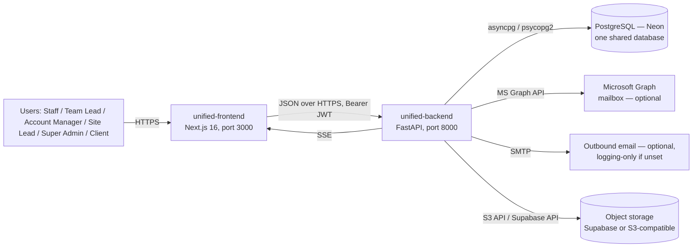

# Architecture Overview

## System context

## Two processes, one database

| Component | What it is | Tech | Default port |
|---|---|---|---|
| `unified-backend/` | One FastAPI app serving RBAC (`/api/v1/...`) and Ticketing (unprefixed) APIs from one process | FastAPI, SQLAlchemy 2 (async), Alembic, PostgreSQL | `:8000` |
| `unified-frontend/` | The only maintained web app — login, RBAC admin, embedded ticket workspace | Next.js 16, React 18, TypeScript | `:3000` |
| `shared_models/` | Single source of truth for `User`/`Role`/`Category` SQLAlchemy models, installed as a local editable package | SQLAlchemy | — |

Both API domains inside `unified-backend` share **one** PostgreSQL database but keep **two independent Alembic histories** (`alembic_rbac/`, `alembic_ticketing/`) — a direct artifact of the system's origin as two separate services merged into one process. See [15-architecture-decisions/ADR-001-database-architecture.md](../15-architecture-decisions/ADR-001-database-architecture.md).

## Why two domains in one process

The system began as three separate git repositories: an RBAC service, a Ticketing service, and this frontend's earlier home. A backend consolidation merged the two backends into one FastAPI app (`unified-backend/app/main.py` mounts `app/rbac/` under `/api/v1` and `app/ticketing/` unprefixed — every route path byte-identical to the old standalone services), and a later frontend consolidation renamed the RBAC frontend to `unified-frontend` once it was confirmed to be a strict superset of the standalone ticketing frontend. See [15-architecture-decisions/ADR-003-ticket-interaction-separation.md](../15-architecture-decisions/ADR-003-ticket-interaction-separation.md) and the "Backend consolidation" / "Frontend consolidation" history in root `CLAUDE.md` for the full narrative.

## Cross-domain identity: RBAC issues, Ticketing verifies

`app.rbac` is the **sole issuer** of JWTs (HS256, `python-jose`). `app.ticketing` is a **verify-only consumer** — it decodes and validates against the same `JWT_SECRET_KEY`, with no login/signup endpoint of its own. The access token carries `permissions`, `scoped_permissions`, `name`, `role_id`, `category_id`, `category`, and `permission_version` claims, letting `app.ticketing`'s `get_current_user` skip a database round trip on a cache hit (`app/core/rbac_cache.py`, per-process TTL cache, default 30s). See [08-security/authentication.md](../08-security/authentication.md) and [05-technical-architecture/backend-architecture.md](../05-technical-architecture/backend-architecture.md).

## What's actually deployed (important — see full detail in [deployment-architecture.md](deployment-architecture.md))

Two deployment paths coexist in this repository:

1. **`render.yaml`** (Render Blueprint) — defines exactly **2** web services today: `unified-backend` and `unified-frontend`. This is a real, buildable blueprint, but confirming it is the one actually serving production traffic requires checking with whoever manages the Render dashboard — see the caveat in [09-deployment](../09-deployment/README.md).
2. **`.github/workflows/deploy.yml`** — the only workflow that fires automatically (on every push to `main`): SSHs into an EC2 host, pulls `main`, runs both Alembic chains, builds the frontend, and restarts two `systemd` services (`unified-backend`, `unified-frontend`). **This is confirmed to be a live, actively-triggered CI/CD pipeline** — treat it as the primary deployment path unless told otherwise.

`DEPLOYMENT.md` at the repo root describes a **third, older, 4-service Render topology** (`rbac-backend`/`rbac-frontend`/`ticketing-backend`/`ticketing-frontend`) that no longer matches `render.yaml`. Do not follow `DEPLOYMENT.md`'s steps without first re-reading `render.yaml` directly.
