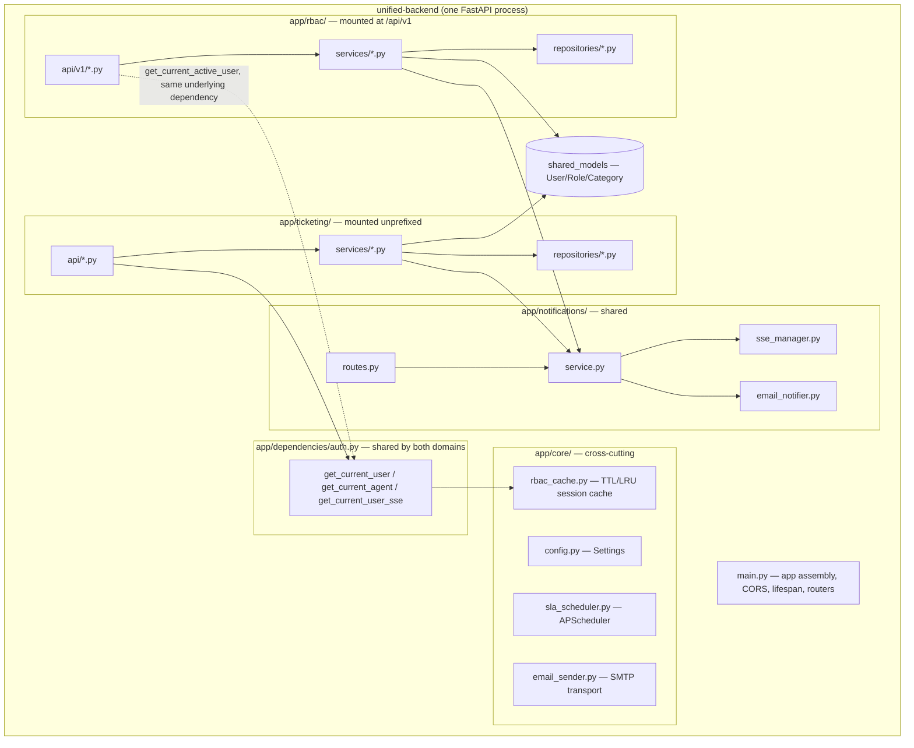
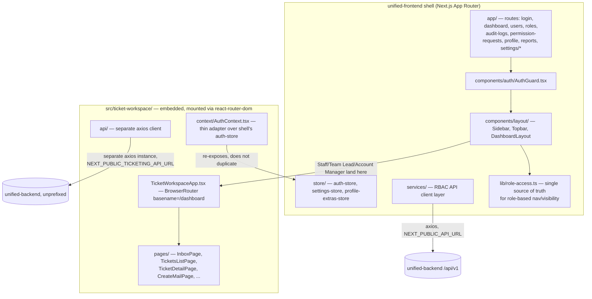

# Component Architecture

## Backend components (`unified-backend/app/`)

### `app/rbac/` — Users, Roles, Permissions, Audit, Organization

Layers: `api/v1/` (routes) → `services/` (business logic + authorization) → `repositories/` (data access) → SQLAlchemy models (`User`/`Role`/`Category` from `shared_models`; `Permission`, `RolePermission`, `AuditLog`, `UserPermissionOverride`, `PermissionRequest`, `ReportingManagerTeam` local to this module). See [05-technical-architecture/backend-architecture.md](../05-technical-architecture/backend-architecture.md).

### `app/ticketing/` — Tickets, Mail, SLA, Escalation

The larger of the two domains: 13 API router files, 30 service files, 16 repository files, 17 model files. Owns the entire client-communication-to-resolved-ticket lifecycle, SLA/escalation clocks, Microsoft Graph mail integration, and the Mail/OTP rule engine. See [04-functional-modules](../04-functional-modules/README.md) for a module-by-module breakdown.

### `app/notifications/` — shared, cross-cutting

The single write path (`NotificationService.notify()`) every trigger in both domains calls through. Fans out to: a DB row, an SSE push (`sse_manager.py`, in-memory per-process pub/sub), and — for a fixed allowlist of business-critical types — a real outbound email (`email_notifier.py`, fire-and-forget background task).

### `app/core/` — configuration, caching, scheduling

`config.py`'s `Settings` (pydantic-settings, `@lru_cache`d) is the one place every environment variable is declared and typed. `rbac_cache.py` is the session-identity cache described above. `sla_scheduler.py` wires an in-process `AsyncIOScheduler` job into the FastAPI `lifespan` hook — the SLA sweep's actual production trigger.

## Frontend components (`unified-frontend/src/`)

**Both API clients (`src/lib/api.ts` and `src/ticket-workspace/api/client.ts`) point at the same backend process** — they're separate Axios instances for historical reasons (the pre-merge two-service world), not because they talk to different servers today. See [05-technical-architecture/frontend-architecture.md](../05-technical-architecture/frontend-architecture.md).

## Design-token unification

`.tm-scope` (`src/app/globals.css`) remaps the embedded ticket workspace's own CSS variables onto the shell's computed dark-theme values, so the two visually-distinct original products render as one consistent design system.
