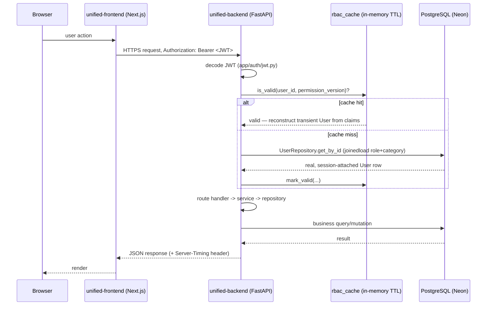
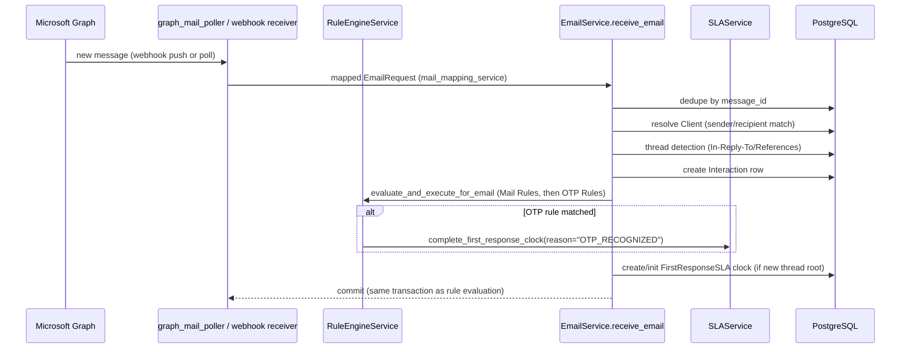
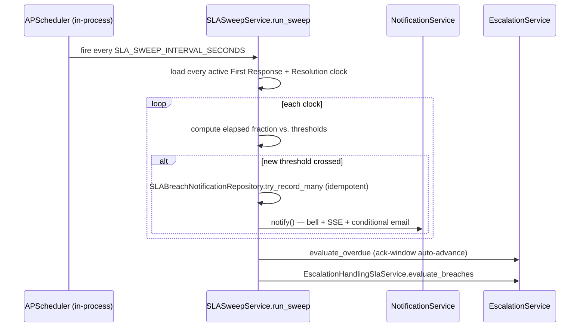
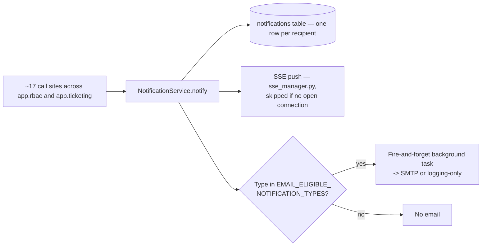

# Data Flow

## Request/response (authenticated API call)

## Inbound email → ticket (the core business flow)

Full narrative, business rules, and edge cases: [03-business-workflows/communication](../03-business-workflows/communication/).

## SLA sweep tick

Full detail: [03-business-workflows/sla](../03-business-workflows/sla/) and [03-business-workflows/escalation](../03-business-workflows/escalation/).

## Notification fan-out

