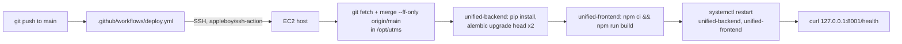

# Deployment Architecture (summary — full runbook in [09-deployment](../09-deployment/README.md))

**Two deployment mechanisms exist in this repository. Confirm with whoever manages production infrastructure which one is actually live before making assumptions.**

## Path A — GitHub Actions → EC2 (confirmed to actively fire on every push to `main`)

This is the only workflow file in `.github/workflows/` (confirmed — no `sla-sweep.yml` exists despite being referenced by comments elsewhere). It is a real, currently-wired CI/CD pipeline, not a placeholder.

## Path B — Render Blueprint (`render.yaml`)

Defines exactly **2** services today:

| Service | Type | Root dir | Build | Start |
|---|---|---|---|---|
| `unified-backend` | Python web service | `unified-backend` | `pip install -r requirements.txt` | `bash scripts/start.sh` |
| `unified-frontend` | Node web service | `unified-frontend` | `npm ci && npm run build` | `npm run start` |

This is **not** the 4-service topology (`rbac-backend`/`rbac-frontend`/`ticketing-backend`/`ticketing-frontend`) that `DEPLOYMENT.md` at the repo root still documents — that file is stale relative to the current `render.yaml`. Whether Render or EC2 (or both) currently serves real production traffic is **not confirmed** by this documentation pass — see [09-deployment/environments.md](../09-deployment/environments.md).

## Shared facts regardless of path

- Both paths run the exact same two Alembic chains in the exact same order (`alembic_rbac` then `alembic_ticketing`) before starting the app.
- Both target the same Neon PostgreSQL database and the same Supabase/S3 storage project.
- The SLA sweep is in-process (APScheduler) in both — no separate scheduler process to deploy.
- A health check exists at `/health` in both — but the two paths check **different ports** (EC2's workflow curls `127.0.0.1:8001`; Render/`start.sh` default to `8000` via `$PORT`) — a real, confirmed discrepancy worth reconciling. See [14-troubleshooting/deployment](../14-troubleshooting/deployment/).
