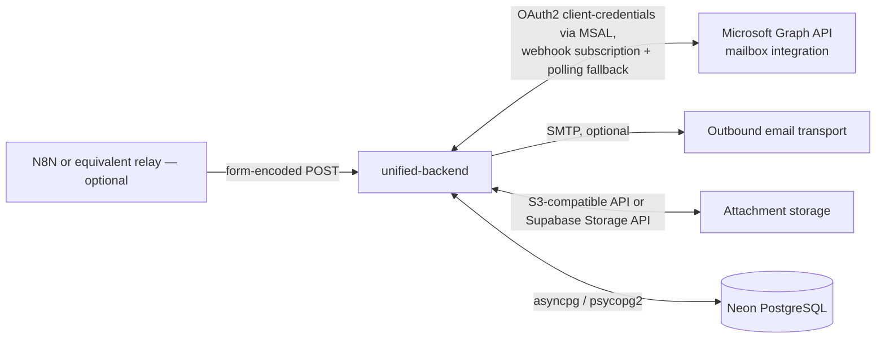

# Integration Architecture

Every external system UTMS actually talks to, confirmed from `app/core/config.py`'s `Settings` and the services that consume them.

## Microsoft Graph (mailbox integration) — optional

| Aspect | Detail |
|---|---|
| Why it exists | Receive/send ticket-related email through a real mailbox rather than a manual/simulated intake |
| Authentication | MSAL client-credentials flow (`app/ticketing/services/graph_auth.py`), configured via `GRAPH_TENANT_ID`/`GRAPH_CLIENT_ID`/`GRAPH_CLIENT_SECRET`/`GRAPH_MAILBOX_ADDRESS` |
| Transport (inbound) | Two parallel paths: (1) a webhook subscription (`graph_subscription_service.py`, created/renewed on a schedule, delivering to `POST /api/mail/incoming`, verified via `GRAPH_WEBHOOK_CLIENT_STATE`) and (2) a polling fallback (`graph_mail_poller.py`, for local dev with no public HTTPS URL, looking back 15 minutes on first tick, per-mailbox checkpoints) |
| Transport (outbound) | `graph_client.py`'s `GraphMailProviderClient`, selected by `mail_provider.get_mail_provider_client()` when all four Graph settings are populated |
| Data exchanged | Message metadata, HTML/plain-text body, attachments (fetched without `$select` — see below), threading headers (`internetMessageHeaders`, `In-Reply-To`/`References`) |
| Failure handling | All four Graph settings unset ⇒ `MockMailProviderClient` (safe no-op for local dev); a Graph API error during send/fetch is logged, not silently swallowed (verify exact retry behavior in `graph_client.py` before relying on it — **not independently re-confirmed** in this pass) |
| Known constraint | `/messages/{id}/attachments` cannot use `$select` including `contentBytes` (a derived-type-only property) — the fix removes `$select` entirely for this call, transferring the full object. See [16-known-limitations/integration-limitations.md](../16-known-limitations/integration-limitations.md). |
| Relevant files | `app/ticketing/services/{graph_auth,graph_client,graph_mail_poller,graph_subscription_service,mail_mapping_service}.py`, `app/ticketing/api/mail_integration.py`, `app/core/{graph_mail_poll_scheduler,graph_subscription_scheduler}.py` |

## SMTP (outbound email) — optional

| Aspect | Detail |
|---|---|
| Why it exists | Deliver business-critical notifications (assignment, escalation, SLA breach, client reply, edit-access decisions) as real email, not just in-app |
| Authentication | SMTP username/password (`SMTP_USERNAME`/`SMTP_PASSWORD`), TLS by default |
| Failure handling | `SMTP_HOST` unset ⇒ logging-only fallback (`LoggingEmailSender`); a per-recipient send failure is caught/logged and never propagates past the fire-and-forget dispatch task |
| Relevant files | `app/core/email_sender.py` (`EmailSender`/`SMTPEmailSender`/`LoggingEmailSender`/`get_email_sender()`), `app/notifications/{email_notifier,email_content,email_policy}.py` |

## Attachment storage (Supabase or S3-compatible)

| Aspect | Detail |
|---|---|
| Why it exists | Store files attached to Interactions (inbound Graph attachments or agent uploads) outside the database |
| Authentication | `SUPABASE_URL`/`SUPABASE_SERVICE_ROLE_KEY`, or S3-style access/secret keys + endpoint |
| Data exchanged | File bytes on upload; a time-limited presigned URL on download (`GET /attachments/{id}/download` redirects to it — the backend never proxies file bytes itself) |
| Failure handling | A misconfigured backend raises `StorageConfigurationError`, caught by a dedicated FastAPI exception handler in `main.py` and returned as a clean 503 (not a bare, CORS-header-less 500) |
| Relevant files | `app/ticketing/storage/{base,supabase_storage,s3_storage}.py`, factory in `app/ticketing/storage/__init__.py` |

## Inbound email transport (N8N / generic relay)

`POST /emails/incoming` (`app/ticketing/api/email.py`) accepts form-encoded inbound email, unauthenticated (service-to-service). Exists alongside the Graph-specific webhook as a more generic transport option. **Not confirmed** whether N8N (or any specific relay product) is actually wired to this endpoint in the current production environment — verify with whoever manages the mail pipeline before assuming it's active.

## Neon PostgreSQL

The one physical database both domains share. Connection strings are normalized in `app/core/config.py` (Neon's `postgres://`/`sslmode=`/`channel_binding=` kwargs rewritten for asyncpg compatibility). See [06-database](../06-database/README.md).
