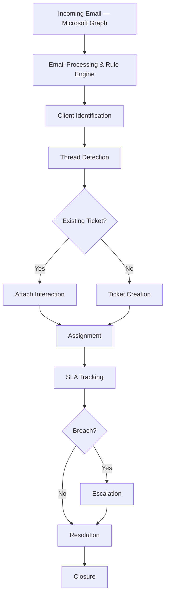

# Business Workflows

This is the most important section of this documentation set. It traces every major business process end-to-end — through the actual API endpoints, services, repositories, and database tables that implement it — so a developer can go from "what does the business rule say" to "where is that enforced in code" in one hop.

See [workflow-standards.md](workflow-standards.md) for the template every workflow document follows.

## The core end-to-end flow

## Workflow groups

| Group | Documents | What it covers |
|---|---|---|
| [authentication/](authentication/) | [login.md](authentication/login.md) | How a session starts and what it carries |
| [communication/](communication/) | [incoming-email.md](communication/incoming-email.md), [email-processing.md](communication/email-processing.md), [thread-detection.md](communication/thread-detection.md) | Inbound email from Graph to a stored, threaded Interaction |
| [ticket/](ticket/) | [ticket-creation.md](ticket/ticket-creation.md), [ticket-assignment.md](ticket/ticket-assignment.md), [ticket-processing.md](ticket/ticket-processing.md), [ticket-status-lifecycle.md](ticket/ticket-status-lifecycle.md), [ticket-resolution.md](ticket/ticket-resolution.md) | The ticket itself, from creation to close |
| [sla/](sla/) | [sla-lifecycle.md](sla/sla-lifecycle.md), [sla-calculation.md](sla/sla-calculation.md), [sla-pause-resume.md](sla/sla-pause-resume.md), [sla-breach.md](sla/sla-breach.md) | The two SLA clocks and their breach ladder |
| [escalation/](escalation/) | [escalation-workflow.md](escalation/escalation-workflow.md), [escalation-handoff.md](escalation/escalation-handoff.md), [escalation-ai-processing.md](escalation/escalation-ai-processing.md) | The ownership-handoff chain triggered by an SLA breach |
| [notification/](notification/) | [notification-workflow.md](notification/notification-workflow.md) | The single fan-out path every trigger uses |
| [audit/](audit/) | [audit-workflow.md](audit/audit-workflow.md) | The two separate audit-trail systems |

## How to read these documents against the code

Every workflow document ends with a **Relevant Source Files** section giving exact paths. Combine that with [07-api](../07-api/README.md) (endpoint reference) and [06-database](../06-database/README.md) (table reference) to go from "what happens" to "where."
