# Incoming Email Workflow

## 1. Purpose
Capture an inbound client email reliably, regardless of transport, as the entry point to the entire ticket lifecycle.

## 2. Trigger
One of: a Microsoft Graph webhook push (`POST /api/mail/incoming`), a Graph polling-fallback tick (`graph_mail_poller.py`, scheduled), or a generic relay POST (`POST /emails/incoming`).

## 3. Actors
External sender (client or any email address), Microsoft Graph (or a generic relay), the system itself (no human actor at this stage).

## 4. Preconditions
- For the Graph path: `GRAPH_TENANT_ID`/`GRAPH_CLIENT_ID`/`GRAPH_CLIENT_SECRET`/`GRAPH_MAILBOX_ADDRESS` configured, and (for the webhook path) an active subscription (`graph_subscription_service.py`) plus a matching `GRAPH_WEBHOOK_CLIENT_STATE`.
- If none of the four Graph settings are configured, the system falls back to a `MockMailProviderClient` — inbound mail arrives only via whichever transport is actually wired (verify per environment).

## 5. High-Level Flow

```mermaid
flowchart LR
    A[Graph webhook or poll] --> B[Fetch full message + attachments]
    B --> C[Map to internal EmailRequest]
    C --> D[EmailService.receive_email]
    D --> E[dedupe by message_id]
    E --> F[Client identification]
    F --> G[Thread detection]
    G --> H[Create Interaction]
    H --> I[Rule engine evaluation]
    I --> J[SLA clock init/completion]
```

## 6. Detailed Workflow
1. **Webhook path**: Graph posts a change notification to `POST /api/mail/incoming`; the handler validates the handshake/`clientState`, then processes the notification batch in a background task, returning 202 immediately.
2. **Polling path**: `graph_mail_poller.py`, on a scheduler tick, queries each configured mailbox since its last checkpoint (`INITIAL_LOOKBACK_MINUTES=15` on first run).
3. Either path fetches the full Graph `message` resource (`MESSAGE_SELECT_FIELDS`, including `internetMessageHeaders` for threading) via `graph_client.GraphMailProviderClient`, and separately fetches attachments (no `$select` — see [16-known-limitations/integration-limitations.md](../../16-known-limitations/integration-limitations.md)).
4. `mail_mapping_service.map_external_email_to_interaction` converts the Graph-shaped payload into the internal `EmailRequest` schema (HTML→plain-text via BeautifulSoup, attachment validation/decoding).
5. `EmailService.receive_email` takes over — see [email-processing.md](email-processing.md) and [thread-detection.md](thread-detection.md) for the rest of the pipeline.

## 7. Business Rules
- Every inbound message is deduplicated by Graph's own `message_id` — a redelivered webhook notification or an overlapping poll window must never create two Interactions for the same email.
- Attachments are only accepted for extensions on an explicit allow-list (`ATTACHMENT_MIME_BY_EXTENSION`); a present-but-mismatched `content_type` (Graph legitimately reports `application/octet-stream` for some real files) is logged, not rejected.

## 8. Decision Points
- Graph fully configured → real provider; otherwise → mock provider (silent, no error).
- Webhook subscription active → webhook path is primary; polling always runs as a fallback regardless.

## 9. Database Changes
None yet at this stage — this workflow only produces the intermediate `EmailRequest`; the actual `Interaction` row is created in [email-processing.md](email-processing.md).

## 10. APIs Involved
`POST /api/mail/incoming`, `GET /api/mail/incoming` (validation-handshake alias), `POST /emails/incoming`. All three are unauthenticated (service-to-service) — see [08-security](../../08-security/README.md) for the integrity model.

## 11. Services / Components Involved
`graph_auth.py`, `graph_client.py`, `graph_subscription_service.py`, `graph_mail_poller.py`, `mail_mapping_service.py`, `mail_provider.py`, `app/core/{graph_mail_poll_scheduler,graph_subscription_scheduler}.py`.

## 12. External Integrations
Microsoft Graph API — see [02-system-architecture/integration-architecture.md](../../02-system-architecture/integration-architecture.md).

## 13. Notifications
None at this stage.

## 14. Audit Events
None at this stage.

## 15. Failure Scenarios
- A Graph API error during fetch is logged (exact retry behavior **not independently confirmed** in this pass).
- A malformed/corrupted attachment fails validation and is dropped with a logged reason, not silently or with a hard failure of the whole email.
- OneDrive/SharePoint "cloud link" attachments never appear in Graph's `attachments` collection at all — invisible to this entire pipeline by construction (see [16-known-limitations/integration-limitations.md](../../16-known-limitations/integration-limitations.md)).

## 16. Edge Cases
- Two transports (webhook + poll) can both observe the same email — `message_id` dedup is what prevents a double-Interaction, not transport coordination.

## 17. Postconditions
A validated `EmailRequest` object is handed to `EmailService.receive_email` for client identification, threading, and Interaction creation.

## 18. Relevant Source Files
- `unified-backend/app/ticketing/api/mail_integration.py`, `app/ticketing/api/email.py`
- `unified-backend/app/ticketing/services/{graph_auth,graph_client,graph_subscription_service,graph_mail_poller,mail_mapping_service,mail_provider}.py`
- `unified-backend/app/core/{graph_mail_poll_scheduler,graph_subscription_scheduler}.py`

## 19. Example Scenario
A client emails `support@company-mailbox.com` with a PDF attached via "Attach File → Browse This PC." Graph's webhook fires within seconds; the handler fetches the message and its attachment (no `$select`), maps it to an `EmailRequest`, and hands it to `EmailService.receive_email`. If the client had instead used "Attach as cloud link," the email would arrive with zero attachments in Graph's collection — invisible to this pipeline, by a fundamental Outlook/Graph behavior, not a bug in this system.
