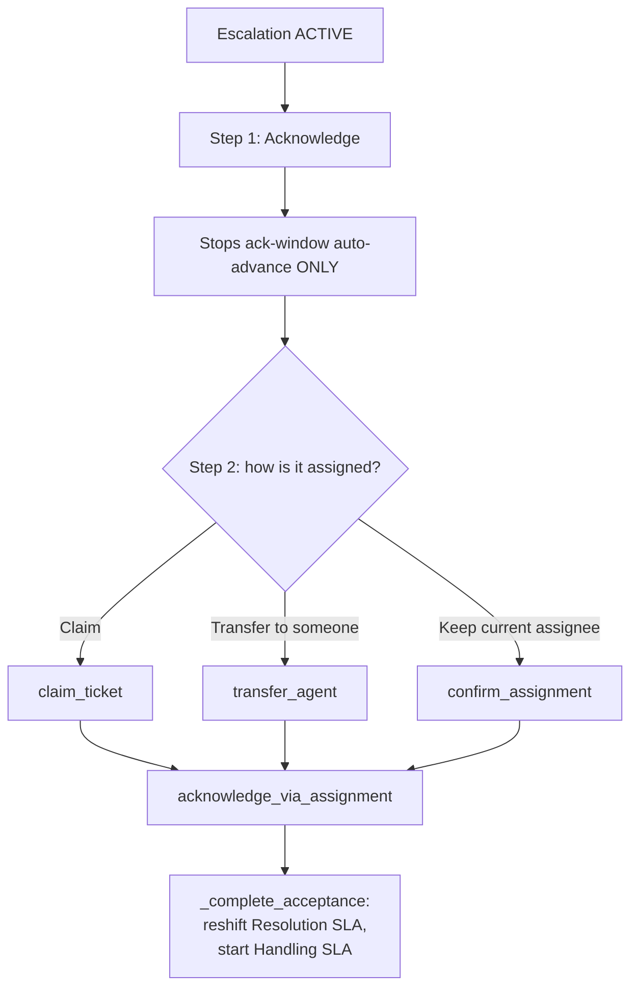

# Escalation Handoff (Acknowledge & Assign) Workflow

## 1. Purpose
Make ownership acceptance a real, two-step, atomic event — rather than a single "Acknowledge" click silently restarting SLA clocks against nobody's actual ownership.

## 2. Trigger
`POST /tickets/{id}/escalation/acknowledge` (step 1), followed by `claim_ticket`/`transfer_agent` or `POST /tickets/{id}/escalation/confirm-assignment` (step 2).

## 3. Actors
A member of the escalation's current `owner_ids` only — strictly, with no Site Lead/Super Admin overseer bypass (a bypass that used to exist was deliberately removed).

## 4. Preconditions
An `ACTIVE` (or `ACKNOWLEDGED`, for step 2) `TicketEscalation` exists, and the caller is in its current `owner_ids`.

## 5. High-Level Flow

## 6. Detailed Workflow
1. **Acknowledge (step 1)**: `EscalationService.acknowledge()` only stops the ack-window auto-advance (`evaluate_overdue` only considers `ACTIVE` escalations) — it does **not** touch the Resolution SLA or start the Handling SLA. Status becomes `ACKNOWLEDGED`.
2. **Assign (step 2)**: real acceptance only completes via `_complete_acceptance`, reached from `acknowledge_via_assignment` (called by `claim_ticket`/`transfer_agent` when a supervisor assigns/claims an escalated ticket) or `confirm_assignment` (the "keep the current assignee" case, the one path that never calls claim/transfer).
3. `_complete_acceptance` starts `EscalationHandlingSlaService.start_if_not_started` (idempotent — an existing row for the escalation is returned unchanged, so reassigning later never restarts the timer) and reshifts the Resolution SLA.
4. **Candidate picker is role-scoped** (`get_acknowledge_candidates`, backing `GET /tickets/{id}/escalation/acknowledge-candidates`): a Site Lead/Super Admin gets the category's Team Lead(s) + the client's Account Manager; an Account Manager gets their own category-matched reporting Team Lead(s); a Team Lead gets their category's Staff.
5. **Freeze on the previous owner**: `ensure_agent_can_act_on_ticket`, when given an `EscalationHandlingSlaRepository`, reads "has acceptance actually completed" off whether an `EscalationHandlingSLA` row exists (the one and only place `_complete_acceptance` creates one) — not off `status` — so the previous owner stays frozen through the "acknowledged but not yet assigned" gap.

## 7. Business Rules
- **Acknowledging alone is not accepting.** This was a deliberate fix to a real gap: a supervisor who clicked Acknowledge and never got around to assigning had silently restarted the clock against nobody's actual ownership, and the previous owner regained the ability to act the instant status flipped to `ACKNOWLEDGED`.
- **No overseer bypass** — `acknowledge()`/`confirm_assignment()` both require strict `owner_ids` membership. A Site Lead/Super Admin who is not yet a current owner (the chain hasn't reached them) cannot acknowledge early, even though they could otherwise *view* the ticket via unrestricted visibility.
- The Escalated tab, Acknowledge button, and `is_escalation_owner` response field are all scoped to the escalation's **current** `owner_ids`, not "this ticket has an active escalation" — this prevents a freshly-escalated-to-Team-Lead ticket from prematurely surfacing in every qualifying Account Manager's/Site Lead's queue before the chain actually reaches them.

## 8. Decision Points
- Caller in current `owner_ids`? → required for both acknowledge and assign steps, no exceptions.
- Which of claim/transfer/confirm-assignment completes step 2? → all three funnel into the same `_complete_acceptance`.

## 9. Database Changes
`ticket_escalations.status` (`ACTIVE → ACKNOWLEDGED`), `.acknowledged_at`/`.acknowledged_by`; `escalation_handling_slas` (new row, idempotent); `resolution_slas.due_at` (reshift); `ticket_audit_logs` — `ESCALATION_ACKNOWLEDGED`.

## 10. APIs Involved
`POST /tickets/{id}/escalation/acknowledge`, `POST /tickets/{id}/escalation/confirm-assignment`, `GET /tickets/{id}/escalation/acknowledge-candidates`, plus the ordinary `claim`/`transfer` endpoints (see [ticket/ticket-assignment.md](../ticket/ticket-assignment.md)).

## 11. Services / Components Involved
`EscalationService.{acknowledge,acknowledge_via_assignment,confirm_assignment,_complete_acceptance}`, `EscalationHandlingSlaService.start_if_not_started`, `access_control.ensure_agent_can_act_on_ticket`.

## 12. External Integrations
N/A.

## 13. Notifications
`ESCALATION_ACKNOWLEDGED` (verify exact notification-vs-audit-only distinction in code; not independently confirmed whether this specific transition also fires a `NotificationService.notify()` call).

## 14. Audit Events
`ESCALATION_ACKNOWLEDGED`; the actual acceptance-completing action (claim/transfer) logs its own `ASSIGNED`/`TRANSFERRED` event too.

## 15. Failure Scenarios
A caller outside the current `owner_ids` gets a 403 on both acknowledge and assign steps — no exceptions for any role.

## 16. Edge Cases
- `acknowledge_via_assignment`'s own bail-out was previously miscoded to skip everything unless the escalation was still `ACTIVE` — which broke the single most common real path (Acknowledge, then Assign — by assignment time status is already `ACKNOWLEDGED`). Fixed to only bail out if there's no non-CLOSED escalation at all.
- `AttachmentService.upload_attachment` has never been updated to pass the `EscalationHandlingSlaRepository` into `ensure_agent_can_act_on_ticket` — it still uses the older, coarser `status == ACTIVE` freeze check, a known and accepted inconsistency (falls back safely rather than becoming incorrectly frozen forever).
- `test_acknowledge_and_assign_escalation.py` (10 tests) and `test_escalation_read_only_access.py` (2 tests) are the primary regression guards for this exact acceptance boundary.

## 17. Postconditions
The escalation is `ACKNOWLEDGED`; if step 2 has also completed, the Resolution SLA is reshifted, the Handling SLA is running, and the new owner (not the old one) can act on the ticket.

## 18. Relevant Source Files
- `unified-backend/app/ticketing/services/escalation_service.py`
- `unified-backend/app/ticketing/services/escalation_handling_sla_service.py`
- `unified-backend/app/ticketing/services/access_control.py` (`ensure_agent_can_act_on_ticket`)
- `unified-backend/app/ticketing/api/sla.py`

## 19. Example Scenario
A Team Lead acknowledges a TEAM_LEAD-level escalation (step 1) but is called away before assigning it. The previous Staff owner remains frozen out (no `EscalationHandlingSLA` row exists yet), and the Resolution SLA clock has **not** restarted. The next day, the Team Lead returns and calls `confirm_assignment` to keep the ticket with the original Staff member — only now does `_complete_acceptance` actually reshift the clock and start the Handling SLA.
