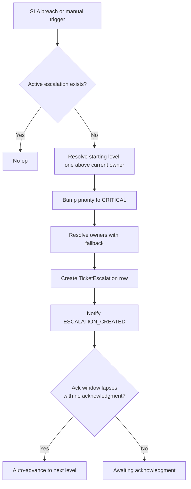

# Escalation Workflow

## 1. Purpose
Hand a breaching ticket's ownership up a real accountability chain, without ever touching the Resolution SLA clock's own bookkeeping — a deliberate architectural separation enforced by the feature's own test suite.

## 2. Trigger
Automatic: `EscalationService.auto_escalate_if_needed`, called from the SLA sweep on a Resolution SLA `BREACHED`/`ESCALATED` crossing. Manual: `POST /tickets/{id}/escalate` (requires `ticket:escalate`).

## 3. Actors
The system (auto-escalation); any agent with `ticket:escalate` (manual); Team Lead/Account Manager/Site Lead (as escalation owners/actors down the chain).

## 4. Preconditions
No already-`ACTIVE` escalation exists for the ticket (enforced by a partial unique index, `ix_ticket_escalations_one_active_per_ticket`).

## 5. High-Level Flow

## 6. Detailed Workflow
1. **Starting level is dynamic** (`_resolve_starting_level`): one level *above* whoever currently owns the ticket — a Staff-owned or unclaimed ticket starts at `TEAM_LEAD`; a ticket already assigned to a Team Lead starts at `MANAGER` (Account Manager), skipping `TEAM_LEAD` entirely; one assigned to an Account Manager starts at `SITE_LEAD`. Re-notifying the person already failing to act achieves nothing.
2. **CRITICAL priority bump** (`_bump_priority_to_critical`) runs as the first line of `_create_escalation` — idempotent (no-op if already CRITICAL), reuses the exact same `reshift_resolution_clock_for_priority_change` function a manual priority change would call, and writes a `PRIORITY_CHANGED` audit event attributed to `ActorRole.SYSTEM`.
3. **Owner resolution with fallback** (`_resolve_owners_with_fallback`): walks forward from the starting level if it resolves to zero owners (e.g. no Team Lead configured for the category) — an escalation is never created with nobody able to act on it.
4. `TicketEscalation` row created: `status=ACTIVE`, `owner_ids`/`owner_roles` populated, `ack_due_at` set from `SLAPolicy.escalation_ack_target_minutes`.
5. `ESCALATION_CREATED` notification fires (email-eligible).
6. If `ack_due_at` lapses with no acknowledgment, `evaluate_overdue` (run at the end of every sweep tick) advances the escalation to the next level — reusing `ESCALATION_ADVANCED`.

## 7. Business Rules
- **CRITICAL is escalation-only and permanent** — never manually selectable, never reverts (not on acknowledge, not on closing the escalation, not on resolving/closing the ticket itself).
- **The escalation workflow may never write to the Resolution SLA clock's own `started_at`/`due_at`/`status` columns directly** — it only ever calls the shared reshift function, and this invariant is specifically what the feature's own pytest suite exists to guard.
- Unclaimed, escalated tickets are excluded from the Open Pool and are **not** auto-assigned — reachable only via the Escalated tab's Acknowledge & Assign flow. `agent_id` stays null by deliberate design.

## 8. Decision Points
- Current owner's role → determines starting level.
- Starting level resolves to zero owners → fallback walks forward.
- Ack window lapses → auto-advance.

## 9. Database Changes
`ticket_escalations` (new row, or `level`/`owner_ids`/`chain_position` update on advance), `tickets.current_priority = CRITICAL`, `resolution_slas.due_at` (reshift), `ticket_audit_logs` — `PRIORITY_CHANGED`, `ESCALATION_CREATED`, `ESCALATION_ADVANCED`.

## 10. APIs Involved
`POST /tickets/{id}/escalate`, `GET /tickets/{id}/escalation/acknowledge-candidates`. See [escalation-handoff.md](escalation-handoff.md) for the acceptance-side endpoints.

## 11. Services / Components Involved
`EscalationService`, `TicketEscalationRepository`, `SLAService.reshift_resolution_clock_for_priority_change`, `UserRepository.{list_active_by_role_and_category,list_active_staff_by_category}`.

## 12. External Integrations
N/A.

## 13. Notifications
`ESCALATION_CREATED` (email-eligible).

## 14. Audit Events
`PRIORITY_CHANGED` (system-attributed), `ESCALATION_CREATED`, `ESCALATION_ADVANCED`, `ESCALATION_ACKNOWLEDGED`, `ESCALATION_CLOSED` — deliberately distinct from the SLA ladder's own `SLA_ESCALATED` tier; don't conflate the two.

## 15. Failure Scenarios
A corrupted `ticket_type` used to crash the owner-resolution query for every ticket in the same sweep tick, not just the affected one — fixed by validating category values in Python first. See [16-known-limitations/performance-limitations.md](../../16-known-limitations/performance-limitations.md).

## 16. Edge Cases
- `manual_escalate` shares the exact same `_create_escalation`/CRITICAL-bump code path as auto-escalation — a reported "manual escalation bug" once turned out to be a stale-schema symptom (missing migration columns), not a logic defect. Always check `alembic ... current` against `heads` before assuming an SLA/escalation bug report needs a code fix.
- A leftover-dev-data test fragility (`test_overdue_active_escalation_advances_without_touching_sla`) is a known, accepted flake against the shared dev database — see [16-known-limitations/technical-limitations.md](../../16-known-limitations/technical-limitations.md).

## 17. Postconditions
An `ACTIVE` (or further-advanced) `TicketEscalation` row exists; the ticket's priority is `CRITICAL`; the current owners have been notified.

## 18. Relevant Source Files
- `unified-backend/app/ticketing/services/escalation_service.py`
- `unified-backend/app/ticketing/repositories/ticket_escalation_repository.py`
- `unified-backend/app/ticketing/models/ticket_escalation.py`
- `unified-backend/app/ticketing/enums/escalation_enums.py`

## 19. Example Scenario
A ticket claimed by Staff breaches its Resolution SLA. `auto_escalate_if_needed` fires: starting level resolves to `TEAM_LEAD` (Staff is below Team Lead), the category's Team Lead(s) become `owner_ids`, priority bumps to CRITICAL, and `ESCALATION_CREATED` notifies them. Two hours pass with no acknowledgment (the configured ack window); `evaluate_overdue` auto-advances to `MANAGER` (Account Manager) — the Team Lead no longer owns it, but the Staff member who originally had it remains frozen out per [escalation-handoff.md](escalation-handoff.md) until real acceptance completes.
