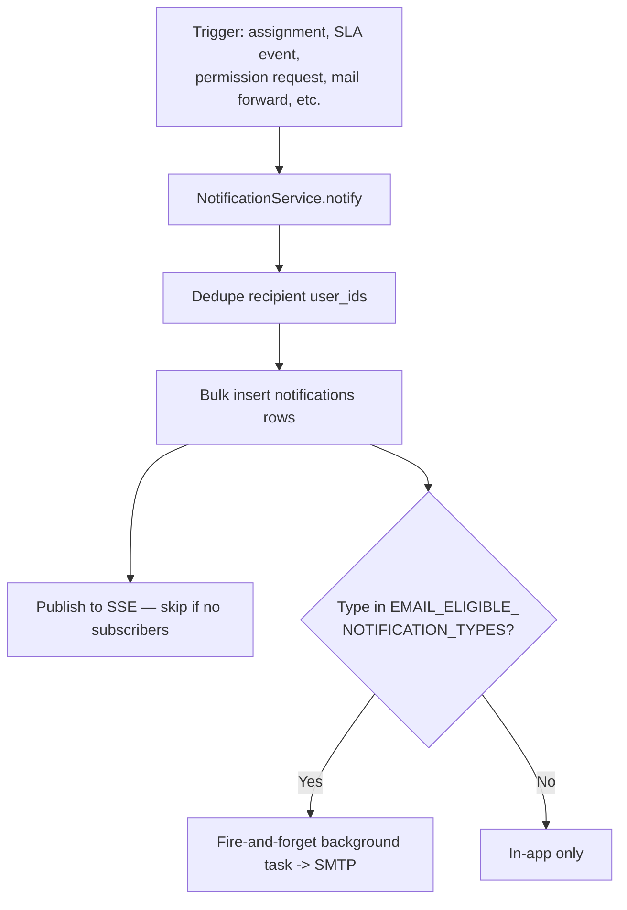

# Notification Workflow

## 1. Purpose
Deliver a single, consistent notification (in-app + optionally email) for every significant event across both API domains, through exactly one write path.

## 2. Trigger
Any of ~17 call sites across `app.rbac` and `app.ticketing` calling `NotificationService.notify(user_ids, notification_type, title, message, ...)`.

## 3. Actors
The system (all triggers are code-driven, not user-initiated directly).

## 4. Preconditions
None beyond having at least one valid recipient `user_id`.

## 5. High-Level Flow

## 6. Detailed Workflow
1. `notify()` collapses `user_ids` into a unique set — no-ops on empty, so a call with zero valid recipients (e.g. `_forward_to_employees` resolving to none) creates nothing.
2. `NotificationRepository.create_many()` bulk-inserts one row per recipient, returning the created rows (a small additive change made specifically to support step 3).
3. `_publish_to_streams` pushes to each recipient's open SSE connections (`sse_manager.py`) — cheaply skipped via `has_subscribers()` if nobody's listening.
4. `_dispatch_emails`/`queue_notification_emails` schedules a fire-and-forget `asyncio.create_task` on a **separate, freshly-opened `AsyncSessionLocal()` session** (not the caller's request-scoped session, which may already be closed by the time the background task runs) — only for types in `EMAIL_ELIGIBLE_NOTIFICATION_TYPES`.
5. Both the SSE publish and the email dispatch are wrapped in a never-raise `try/except` — a problem in either can never fail the write path that already durably created the notification rows.

## 7. Business Rules
- **The email policy lives in exactly one place**: `EMAIL_ELIGIBLE_NOTIFICATION_TYPES` (`app/notifications/email_policy.py`), currently `{TICKET_ASSIGNED, ESCALATION_CREATED, SLA_BREACHED, CLIENT_REPLY, EDIT_ACCESS_APPROVED, EDIT_ACCESS_REJECTED}` per root `CLAUDE.md`'s description — **note**: one research pass in this session found this frozenset defined as exactly `{TICKET_ASSIGNED, ESCALATION_CREATED, CLIENT_REPLY}` (3 members) in the code as inspected; treat the exact current membership as **needing a fresh check against `app/notifications/email_policy.py`** before relying on it for an operational decision, since the two sources disagree and this documentation pass could not fully reconcile them.
- `notify()`'s own recipient dedup is the *only* duplicate-prevention mechanism — there is no separate, cross-call, global email-dedup ledger.
- Deactivated users are never emailed — `UserRepository.get_active_emails_by_ids` filters `is_active = true`, skipped (and logged) recipients that resolve to nothing.

## 8. Decision Points
- Notification type in the email-eligible set? → also queues a real email.
- Recipient has an open SSE connection? → real-time push; otherwise the next `GET /notifications` poll picks it up.

## 9. Database Changes
`notifications` — one row per deduped recipient.

## 10. APIs Involved
`GET /notifications`, `GET /notifications/stream`, `POST /notifications/{id}/read`, `POST /notifications/read-all`, `POST /notifications/clear-all`.

## 11. Services / Components Involved
`NotificationService`, `NotificationRepository`, `NotificationStreamManager` (SSE), `email_notifier.py`, `email_content.py` (ticket-context enrichment, best-effort).

## 12. External Integrations
SMTP (or logging-only fallback if unconfigured).

## 13. Notifications
This document *is* the notification mechanism — see individual workflow documents (ticket, SLA, escalation) for what triggers each specific type.

## 14. Audit Events
Notification creation itself is not separately audit-logged — the triggering action's own audit event (e.g. `TICKET_ASSIGNED`'s corresponding `ASSIGNED` audit entry) is the record.

## 15. Failure Scenarios
A per-recipient email send failure is caught and logged; it never propagates to fail the notification row's creation or affect other recipients in the same call.

## 16. Edge Cases
- `EDIT_ACCESS_APPROVED`/`EDIT_ACCESS_REJECTED` notifications key `related_entity_id` off the edit-access *request*, not a ticket — their emails render "Not applicable" for ticket-context fields rather than a wrong/mismatched ticket, a deliberate scope call.
- Ticket-context enrichment (`load_ticket_context`) uses a deferred import of ticketing models specifically to avoid a circular import, since `app.notifications` is imported by both domains.

## 17. Postconditions
Every intended recipient has a `notifications` row; eligible types have queued (not necessarily yet delivered) an email; any open SSE connection has already received the event.

## 18. Relevant Source Files
- `unified-backend/app/notifications/{service,repository,sse_manager,email_notifier,email_content,email_policy,routes}.py`
- `unified-backend/app/core/email_sender.py`

## 19. Example Scenario
An escalation auto-creates on a SLA breach, targeting two Team Leads. `notify()` dedupes to those two user_ids, creates two `notifications` rows, pushes to both via SSE (one has a tab open, one doesn't — both still get the row), and — since `ESCALATION_CREATED` is email-eligible — queues a background email to both, skipping either one if their account has since been deactivated.
