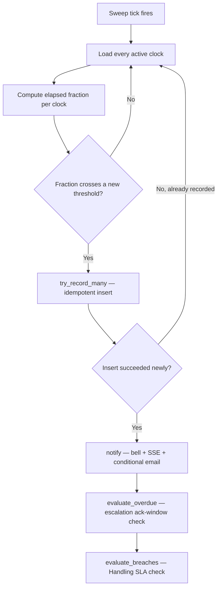

# SLA Breach Detection Workflow

## 1. Purpose
Detect when a clock crosses a risk threshold, notify exactly once per crossing, and trigger downstream escalation when warranted.

## 2. Trigger
`SLASweepService.run_sweep`, fired by the in-process APScheduler on `SLA_SWEEP_INTERVAL_SECONDS` (default 10s locally, 60s in production), or on-demand via `POST /internal/sla/sweep`.

## 3. Actors
The system only.

## 4. Preconditions
At least one active (`RUNNING`/`PENDING`) First Response or Resolution clock exists.

## 5. High-Level Flow

## 6. Detailed Workflow
1. Every active clock's elapsed fraction is computed: `fraction = elapsed_minutes / active_target_minutes`.
2. Compared against four thresholds per clock, using the ticket's `SLAPolicy`: `half_elapsed = warning_1_percentage/100`, `at_risk = warning_2_percentage/100`, `breached = 1.0`, and an escalation-tier threshold above breach.
3. Each `(clock_type, clock_id, threshold, cycle)` crossing is recorded via `SLABreachNotificationRepository.try_record_many` — one batched `INSERT ... ON CONFLICT DO NOTHING ... RETURNING`, so only genuinely-new crossings proceed to notification.
4. For each newly-recorded crossing, `NotificationService.notify()` fires (bell + SSE + email for `SLA_BREACHED`, per `EMAIL_ELIGIBLE_NOTIFICATION_TYPES`; `SLA_AT_RISK`/`SLA_HALF_ELAPSED`/`SLA_ESCALATED` are in-app-only by product decision).
5. On a `BREACHED`/`ESCALATED` crossing of the Resolution SLA specifically, `EscalationService.auto_escalate_if_needed` creates an escalation if one doesn't already exist (see [escalation-workflow.md](../escalation/escalation-workflow.md)).
6. At the end of the same tick, `EscalationService.evaluate_overdue` (ack-window auto-advance) and `EscalationHandlingSlaService.evaluate_breaches` (Handling SLA breach → auto-advance) both run — one sweep, not a second scheduler.

## 7. Business Rules
- **Each threshold notifies exactly once per clock per "cycle"** — the idempotency ledger's unique index includes a `cycle`/`escalation_cycle` column specifically so a ticket that re-breaches after a priority change or an escalation restart gets fresh notifications rather than staying silent forever after its first breach.
- A per-ticket `SAVEPOINT` (`db.begin_nested()`) isolates one ticket's failure from the rest of the sweep tick — **confirmed not to fully hold** against every error class (a corrupted `ticket_type` cascaded into an unrelated ticket's failure later in the same tick before the root cause was fixed) — see [16-known-limitations/performance-limitations.md](../../16-known-limitations/performance-limitations.md).

## 8. Decision Points
- Threshold newly crossed vs. already recorded → whether to notify at all.
- Resolution SLA crossing `BREACHED`/`ESCALATED` → triggers `auto_escalate_if_needed`.
- Escalation ack window lapsed → `evaluate_overdue` advances to the next level.
- Handling SLA breached → `advance_for_handling_sla_breach`.

## 9. Database Changes
`sla_breach_notifications` (idempotency ledger, new row per crossing), `ticket_escalations` (new row on auto-escalation), `notifications` (one per notified recipient).

## 10. APIs Involved
`POST /internal/sla/sweep` (manual/fallback trigger, shared-secret protected — no JWT).

## 11. Services / Components Involved
`SLASweepService`, `SLABreachNotificationRepository`, `NotificationService`, `EscalationService`, `EscalationHandlingSlaService`.

## 12. External Integrations
Email transport (SMTP) for `SLA_BREACHED` specifically.

## 13. Notifications
`SLA_HALF_ELAPSED`/`SLA_AT_RISK`/`SLA_ESCALATED` (in-app only), `SLA_BREACHED` (in-app + email).

## 14. Audit Events
Not the sweep itself, but its downstream effects: `PRIORITY_CHANGED` (CRITICAL bump), `ESCALATION_CREATED`, `ESCALATION_ADVANCED`.

## 15. Failure Scenarios
A corrupted `ticket_type` used to crash the entire tick past the affected ticket — fixed by validating `category_name` in Python before the query reaches Postgres in the two `UserRepository` methods this affected. See [16-known-limitations/performance-limitations.md](../../16-known-limitations/performance-limitations.md).

## 16. Edge Cases
- Local dev's 10-second sweep interval vs. production's 60-second interval — don't extrapolate perceived real-time-ness from local testing.
- `test_sla_sweep_service.py` (11 tests) and `test_sla_breach_notification_repository.py` (8 tests) are the primary regression guards for this exact area.

## 17. Postconditions
Every crossed threshold has exactly one recorded notification; any newly-warranted escalation exists; the ack-window and Handling SLA clocks have been evaluated for the tick.

## 18. Relevant Source Files
- `unified-backend/app/ticketing/services/sla_sweep_service.py`
- `unified-backend/app/ticketing/repositories/sla_breach_notification_repository.py`
- `unified-backend/app/core/sla_scheduler.py`
- `unified-backend/app/ticketing/api/sla_internal.py`

## 19. Example Scenario
A HIGH-priority ticket's Resolution SLA crosses 80% elapsed (`AT_RISK`, `warning_2_percentage=80`). The sweep records the crossing, notifies the assignee and their Team Lead in-app (no email — `SLA_AT_RISK` isn't in the email-eligible set). Two sweep ticks later it crosses 100% (`BREACHED`) — this one **does** email, and `auto_escalate_if_needed` creates a `TEAM_LEAD`-level (or higher, per the dynamic-starting-level rule) escalation.
