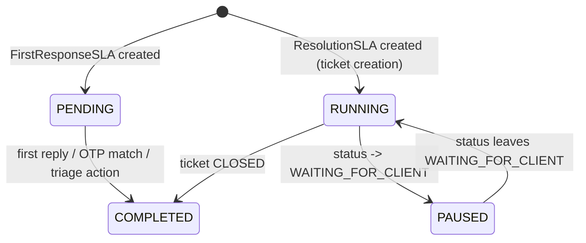

# SLA Lifecycle Workflow

## 1. Purpose
Track two independent, time-based service commitments per ticket from start to completion, with graduated risk visibility along the way.

## 2. Trigger
First Response SLA: creation of a new thread-root Interaction. Resolution SLA: ticket creation.

## 3. Actors
The system (automatic clock management); agents/supervisors (manual pause/resume/priority changes that affect the clocks).

## 4. Preconditions
An `SLAPolicy` row exists for the ticket's priority tier (seeded: LOW/MEDIUM/HIGH/CRITICAL, each with First Response/Resolution/Escalation-Ack targets and warning percentages).

## 5. High-Level Flow

## 6. Detailed Workflow
- **First Response SLA** (`first_response_slas`): one row per thread root. `due_at = started_at + policy.first_response_target_minutes`. Completes via a human triage action (reply/archive/attach/create-ticket) or an OTP Rule match — whichever happens first, via the same `complete_first_response_clock` function every path calls through.
- **Resolution SLA** (`resolution_slas`): one row per ticket. `due_at` is a **mutable, shifting** value (not an accumulated-elapsed counter) — it moves forward on priority change and effectively pauses via `resolution_sla_pause_intervals`, rather than tracking elapsed-vs-remaining separately.
- Both clocks are evaluated every sweep tick (`SLASweepService.run_sweep`) against four thresholds — see [sla-breach.md](sla-breach.md).

## 7. Business Rules
- **SLA targets depend on priority, and priority alone** — sourced from `SLAPolicy`, a live-editable table, never a hardcoded constant. Changing a policy row takes effect on the *next* sweep evaluation, not retroactively re-computing already-elapsed time.
- Two clocks are genuinely independent — a ticket can complete its First Response SLA (agent replied promptly) while its Resolution SLA is still breaching (the underlying issue isn't fixed yet), and vice versa is structurally impossible only in the sense that Resolution always starts at creation regardless of First Response's state.

## 8. Decision Points
- New thread root vs. reply → whether a new First Response clock is created.
- Status entering/leaving `WAITING_FOR_CLIENT` → Resolution clock pause/resume.
- Priority change → Resolution clock `due_at` reshift (see [sla-calculation.md](sla-calculation.md)).
- Ticket closed (not just resolved) → Resolution clock completion.

## 9. Database Changes
`first_response_slas`, `resolution_slas`, `resolution_sla_pause_intervals`, `sla_policies` (read, not written, by the clocks themselves).

## 10. APIs Involved
`GET /tickets/{id}/sla`, `GET /sla/policies`, `PATCH /sla/policies/{id}`.

## 11. Services / Components Involved
`SLAService`, `SLASweepService`, `FirstResponseSlaRepository`, `ResolutionSlaRepository`, `SLAPolicyRepository`.

## 12. External Integrations
N/A directly (the sweep is in-process — see [09-deployment](../../09-deployment/README.md) for the scheduler).

## 13. Notifications
See [sla-breach.md](sla-breach.md).

## 14. Audit Events
`SLA_PAUSED`/`SLA_RESUMED` (status-driven or manual override), `PRIORITY_CHANGED` (reshift side effect).

## 15. Failure Scenarios
See [16-known-limitations/performance-limitations.md](../../16-known-limitations/performance-limitations.md) for the historical corrupted-`ticket_type` sweep-crash incident.

## 16. Edge Cases
See [sla-pause-resume.md](sla-pause-resume.md) and [sla-calculation.md](sla-calculation.md) for clock-math edge cases; `test_sla_clock_math.py` (30 tests) is the primary regression guard for this area.

## 17. Postconditions
Every active ticket has exactly one running-or-completed Resolution SLA clock and exactly one First-Response clock per thread (root only).

## 18. Relevant Source Files
- `unified-backend/app/ticketing/models/{first_response_sla,resolution_sla,resolution_sla_pause_interval,sla_policy}.py`
- `unified-backend/app/ticketing/services/{sla_service,sla_sweep_service}.py`
- `unified-backend/tests/test_sla_clock_math.py`

## 19. Example Scenario
A HIGH-priority ticket is created. Resolution SLA starts, `due_at` = creation + HIGH's resolution target. Two days later the client requests a status update be paused while they gather information — clock pauses. Three days after that, they respond — clock resumes, `due_at` effectively extends by the paused duration. The ticket is closed a day later, completing the clock.
