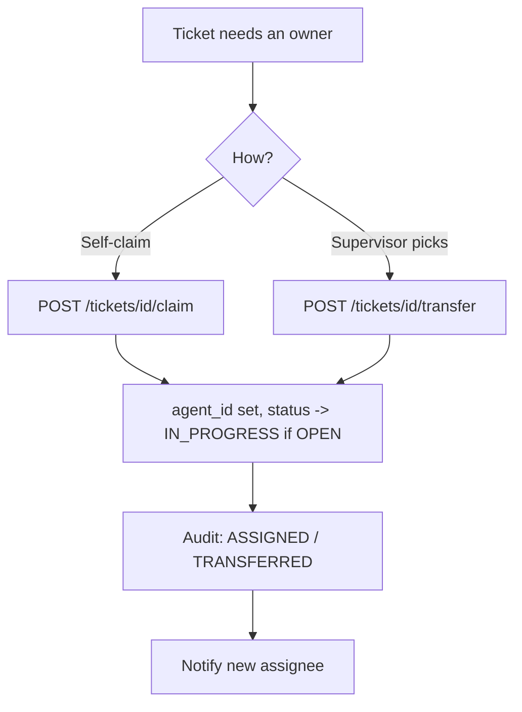

# Ticket Assignment Workflow

## 1. Purpose
Establish (or change) who is responsible for working a ticket — via supervisor assignment, self-claim from the pool, or transfer.

## 2. Trigger
`POST /tickets/{id}/claim`, `POST /tickets/{id}/transfer`, or an initial `agent_id` at ticket creation.

## 3. Actors
Staff (claim), any agent role (transfer, within their authority), supervisors (Account Manager/Team Lead/Site Lead/Super Admin — assigning to others).

## 4. Preconditions
- **Claim**: ticket is unassigned and in the Open Pool (not excluded by an active escalation — see below).
- **Transfer**: caller has transfer authority over the target agent per `AssignmentService`'s role-scoped rules.

## 5. High-Level Flow

## 6. Detailed Workflow
1. **Candidate resolution** (`AssignmentService.get_assignable_groups`): role-scoped — Account Manager sees every active Team Lead company-wide plus their own reports' Staff (a deliberately widened rule, see [04-functional-modules/organization-structure.md](../../04-functional-modules/organization-structure.md)); Team Lead sees their own category's Staff; Site Lead/Super Admin see everyone active.
2. **Server-side validation** (`resolve_target`): a submitted `agent_id` is checked against the caller's actual authority — a crafted request can't assign outside it.
3. **Transfer to Staff is unconditionally category-scoped** (`InteractionService.transfer_agent`) — this was previously only enforced during an active escalation; now enforced always.
4. **Claim** (`POST /tickets/{id}/claim`): sets `agent_id`, transitions `current_status` from `OPEN` to `IN_PROGRESS` if applicable.
5. Every assignment change writes a `ticket_audit_logs` event and fires a `TICKET_ASSIGNED` notification (also emailed — see [notification/notification-workflow.md](../notification/notification-workflow.md)).

## 7. Business Rules
- **Escalated-but-unclaimed tickets are excluded from the Open Pool** — reachable only via the Escalated tab's Acknowledge & Assign flow, never plain claim.
- Account Manager's ticket-assignment authority is deliberately wider than their real reporting line (any Team Lead company-wide) — a distinct concept from the real `manager_id`/`teamlead_id` reporting relationship. See [04-functional-modules/organization-structure.md](../../04-functional-modules/organization-structure.md).

## 8. Decision Points
- Ticket has an active escalation? → excluded from pool regardless of `agent_id`.
- Target is Staff vs. Team Lead vs. cross-category? → different scoping rules apply.

## 9. Database Changes
`tickets.agent_id`, `.assigned_by`, `.current_status` (claim only); `ticket_audit_logs` — `ASSIGNED`/`TRANSFERRED`.

## 10. APIs Involved
`POST /tickets/{id}/claim`, `POST /tickets/{id}/transfer`, `GET /tickets/{id}/transfer-candidates`, `GET /agents/assignable`.

## 11. Services / Components Involved
`AssignmentService`, `InteractionService.transfer_agent`, `TicketService`.

## 12. External Integrations
N/A.

## 13. Notifications
`TICKET_ASSIGNED` (email-eligible).

## 14. Audit Events
`ASSIGNED` / `TRANSFERRED` type events in `ticket_audit_logs` (exact enum member name — verify against `AuditEventType` in `app/ticketing/enums/audit_enums.py`; not independently re-confirmed letter-for-letter in this pass).

## 15. Failure Scenarios
A crafted `agent_id` outside the caller's authority is rejected server-side by `resolve_target`, regardless of what the frontend picker would have offered.

## 16. Edge Cases
- Acknowledging an escalation via assignment (`claim`/`transfer` on an escalated ticket) is itself part of the Escalation workflow's acceptance mechanism — see [escalation/escalation-handoff.md](../escalation/escalation-handoff.md).
- `test_transfer_candidates.py` and `test_transfer_agent_ownership.py` (`unified-backend/tests/`) cover eligible-candidate resolution and role-gated self-assignment of escalated tickets.

## 17. Postconditions
`tickets.agent_id` reflects the new owner; the assignee is notified.

## 18. Relevant Source Files
- `unified-backend/app/ticketing/api/ticket.py`
- `unified-backend/app/ticketing/services/{assignment_service,interaction_service,ticket_service}.py`
- `unified-backend/app/ticketing/api/agent.py`

## 19. Example Scenario
A Team Lead reassigns an in-progress ticket from one Staff member to another within their own category. `resolve_target` confirms the new agent is real Staff in the Team Lead's own category; `agent_id` updates, a `TRANSFERRED` audit event is logged, and the new assignee gets a `TICKET_ASSIGNED` notification (bell + SSE + email).
