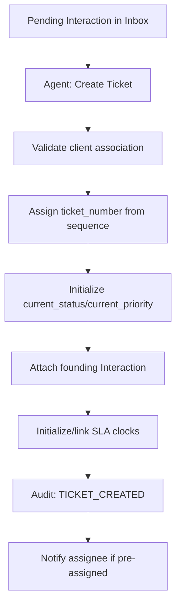

# Ticket Creation Workflow

## 1. Purpose
Convert a pending client communication into a trackable, SLA-governed unit of work.

## 2. Trigger
`POST /tickets/from-interaction` (agent-initiated, from a pending Inbox item) or `POST /tickets/{id}/attach-interaction` (attaching a further interaction to an already-existing ticket).

## 3. Actors
Any agent role (Staff/Team Lead/Account Manager/Site Lead/Super Admin).

## 4. Preconditions
A pending, not-yet-ticketed Interaction exists (usually the thread root of a client email).

## 5. High-Level Flow

## 6. Detailed Workflow
`TicketService.create_ticket()` (called via `POST /tickets/from-interaction`):
1. Validates the client association (the Interaction's `client_id` must resolve to a real, active `Client`).
2. Initializes ticket state: `current_status` (default `OPEN`), `current_priority` (from the request, never `CRITICAL`).
3. Assigns `ticket_number` from the dedicated Postgres `SEQUENCE` (`ticket_number_seq`) — never `MAX()+1`, concurrency-safe by construction.
4. Attaches the founding Interaction (`ticket_id` set on the existing row) — a ticket is always created *from* an interaction, not independently.
5. Initializes SLA tracking: the `ResolutionSLA` clock starts fresh at ticket creation; the `FirstResponseSLA` clock, if the founding interaction is a new thread root, was already created at email-intake time (see [communication/email-processing.md](../communication/email-processing.md)) — ticket creation does not duplicate it.
6. Records the initial `TICKET_CREATED` audit event (`ticket_audit_logs`).
7. If created with an initial assignee, fires an assignment notification.

## 7. Business Rules
- **A ticket is always created from an existing communication, never from nothing** — `ticket_type` and client association are both derived from the founding Interaction, not entered blind.
- `ticket_number` (the human-readable `TKT-<n>`) is assigned once and never reused, even if the ticket is later deleted — enforced by the sequence, not application logic.
- `current_priority` can never be set to `CRITICAL` at creation — that value is escalation-only (see [sla/sla-calculation.md](../sla/sla-calculation.md)).

## 8. Decision Points
- Does the founding interaction already have a reply? → affects whether the First Response SLA clock is already completed by the time the ticket exists.
- Initial assignee specified? → determines whether an assignment notification fires immediately.

## 9. Database Changes
- `tickets` — new row, `ticket_number` from `ticket_number_seq`.
- `interactions.ticket_id` — set on the founding interaction.
- `resolution_slas` — new row, `status=RUNNING`, `due_at` from the priority's `SLAPolicy.resolution_target_minutes`.
- `ticket_audit_logs` — `TICKET_CREATED`.

## 10. APIs Involved
`POST /tickets/from-interaction`, `POST /tickets/{id}/attach-interaction`.

## 11. Services / Components Involved
`TicketService`, `TicketRepository`, `SLAService` (Resolution clock init), `AuditLogService`.

## 12. External Integrations
N/A (upstream email intake already handled).

## 13. Notifications
`TICKET_ASSIGNED` if created with an initial assignee (also emailed — see [notification/notification-workflow.md](../notification/notification-workflow.md)).

## 14. Audit Events
`TICKET_CREATED` (`ticket_audit_logs`).

## 15. Failure Scenarios
An Interaction with no resolvable client fails validation before any ticket row is created — no partial/orphaned ticket state.

## 16. Edge Cases
- A corrupted `ticket_type` not matching any real `CategoryName` used to crash the entire SLA sweep tick for every ticket, not just this one — fixed by validating `category_name` in Python before it reaches Postgres (see [16-known-limitations/performance-limitations.md](../../16-known-limitations/performance-limitations.md)). This is a downstream consequence of ticket creation, not a creation-time failure itself, but worth knowing when creating tickets with unusual `ticket_type` values.
- A one-time contiguous-renumbering migration (`c4d6e8f0a2b4`) corrected a real dataset where `ticket_number` values jumped from `TKT-06` to `TKT-187` due to stale test data present when the sequence was first backfilled — see [06-database/migrations.md](../../06-database/migrations.md).

## 17. Postconditions
A `Ticket` row exists with a unique `ticket_number`, an attached founding Interaction, and a running Resolution SLA clock.

## 18. Relevant Source Files
- `unified-backend/app/ticketing/api/ticket.py`
- `unified-backend/app/ticketing/services/ticket_service.py`
- `unified-backend/app/ticketing/repositories/ticket_repository.py`
- `unified-backend/alembic_ticketing/versions/277b41c65b53_add_ticket_number_sequence.py`

## 19. Example Scenario
A Staff member opens a pending client email in the Inbox and clicks "Create Ticket," leaving Assigned To as "Unassigned (Team)" (the frontend's default). `TicketService.create_ticket` assigns `TKT-08`, sets `current_status=OPEN`, `current_priority=MEDIUM`, starts the Resolution SLA clock at 48 hours (MEDIUM's `SLAPolicy.resolution_target_minutes`), and logs `TICKET_CREATED`. No assignment notification fires since no agent was specified.
