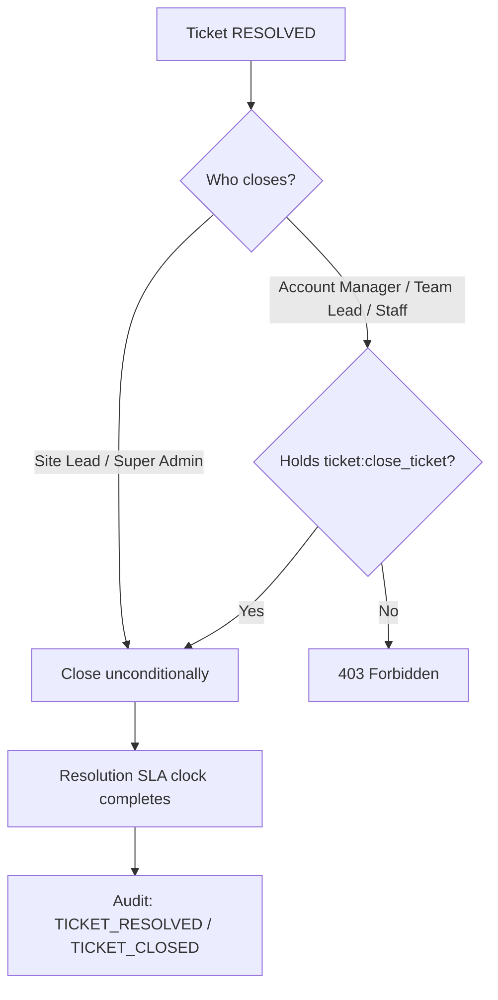

# Ticket Resolution & Closure Workflow

## 1. Purpose
Formally end a ticket's SLA obligation and lock in its outcome, with a real supervisory gate rather than letting any agent unilaterally close their own work.

## 2. Trigger
`POST /tickets/{id}/close`, `POST /tickets/{id}/reopen`.

## 3. Actors
Site Lead/Super Admin (unconditional); Account Manager/Team Lead/Staff (only with the real `ticket:close_ticket` permission).

## 4. Preconditions
Ticket is typically `RESOLVED` before closing (business convention — not independently confirmed as a hard-enforced precondition at the API level).

## 5. High-Level Flow

## 6. Detailed Workflow
1. `POST /tickets/{id}/close` checks `CLOSE_REOPEN_BYPASS_ROLE_NAMES` (`{Site Lead, Super Admin}`) first; if the caller isn't in that set, falls through to a real `ticket:close_ticket` permission check (Override-only for Account Manager/Team Lead/Staff per the permission matrix — a narrowing fixed during the 2026-07-14/15 compliance audit, which found an unconditional Team-Lead bypass that shouldn't have existed).
2. On close: `tickets.current_status = CLOSED`, `closed_at`/`closed_by` set, and — critically — **this is the only transition that completes the Resolution SLA clock**. Entering `RESOLVED` does not.
3. `POST /tickets/{id}/reopen` reverses this, following the same permission gate.

## 7. Business Rules
- **The Resolution SLA clock completes only when a ticket is closed, never merely resolved** — this reflects a deliberate business distinction between "the agent believes the work is done" (`RESOLVED`) and "a supervisor has confirmed and locked it in" (`CLOSED`).
- Only Site Lead/Super Admin get an unconditional close/reopen bypass — every other role needs the real permission, not just a role-name match. This was a real, fixed security gap (an unconditional Team Lead bypass) found during the RBAC compliance audit.

## 8. Decision Points
- Caller in `CLOSE_REOPEN_BYPASS_ROLE_NAMES`? → unconditional.
- Otherwise: holds `ticket:close_ticket`? → allowed; else → 403.

## 9. Database Changes
`tickets.current_status`, `.closed_at`, `.closed_by`; `resolution_slas.status = COMPLETED`, `.completed_at`; `ticket_audit_logs` — `TICKET_RESOLVED`/`TICKET_CLOSED` (or equivalent — exact `AuditEventType` members not independently re-verified letter-for-letter).

## 10. APIs Involved
`POST /tickets/{id}/close`, `POST /tickets/{id}/reopen`.

## 11. Services / Components Involved
`TicketService`, `SLAService` (clock completion), `access_control.py` (`CLOSE_REOPEN_BYPASS_ROLE_NAMES`).

## 12. External Integrations
N/A.

## 13. Notifications
Not independently confirmed which notification type(s) fire on close/reopen in this pass — verify in `TicketService`/`NotificationService` call sites.

## 14. Audit Events
`TICKET_RESOLVED` / `TICKET_CLOSED` (ticket-workspace's own `AuditEventType` — verify exact members in `app/ticketing/enums/audit_enums.py`).

## 15. Failure Scenarios
A non-bypass-role caller without `ticket:close_ticket` gets a clean 403, not a silent no-op.

## 16. Edge Cases
- An escalation still open on a ticket at close time — interaction between escalation closure and ticket closure was **not independently traced** in this pass; verify `EscalationService`'s own closure conditions if this scenario matters (see [escalation/escalation-workflow.md](../escalation/escalation-workflow.md)).

## 17. Postconditions
`tickets.current_status = CLOSED`; the Resolution SLA clock is permanently completed and will not reopen even if the ticket is later reopened (verify — reopening a closed ticket's effect on an already-completed SLA clock was **not independently confirmed**).

## 18. Relevant Source Files
- `unified-backend/app/ticketing/api/ticket.py`
- `unified-backend/app/ticketing/services/{ticket_service,sla_service}.py`
- `unified-backend/app/ticketing/services/access_control.py` (`CLOSE_REOPEN_BYPASS_ROLE_NAMES`)

## 19. Example Scenario
A Team Lead holding an Override-granted `ticket:close_ticket` permission closes a ticket their Staff member marked `RESOLVED` yesterday. The Resolution SLA clock — which kept running through `RESOLVED` — completes only now, at the moment of closure, and `TICKET_CLOSED` is logged with the Team Lead as the actor.
