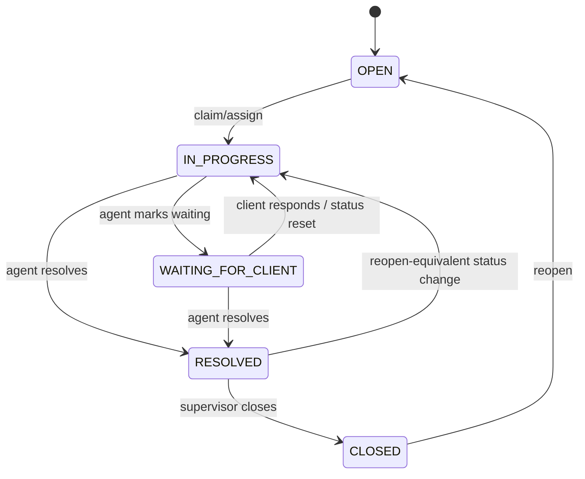

# Ticket Status Lifecycle Workflow

## 1. Purpose
Track a ticket's work state, and drive the Resolution SLA's pause/resume behavior directly off it.

## 2. Trigger
`POST /tickets/{id}/status`.

## 3. Actors
Any agent with action authority on the ticket.

## 4. Preconditions
Ticket is not closed (closed tickets require `POST /tickets/{id}/reopen` first).

## 5. High-Level Flow

(`TicketStatus` enum values confirmed: `OPEN, IN_PROGRESS, PENDING, WAITING_FOR_CLIENT, RESOLVED, CLOSED` — the diagram above shows the meaningful transitions; `PENDING` exists as a value but its specific trigger was not independently traced in this pass.)

## 6. Detailed Workflow
1. `POST /tickets/{id}/status` validates the requested transition and updates `tickets.current_status`.
2. **Entering `WAITING_FOR_CLIENT`**: `InteractionService.change_status` calls `SLAService.pause_resolution_clock` — logs `SLA_PAUSED` unconditionally.
3. **Leaving `WAITING_FOR_CLIENT`** to `IN_PROGRESS` or `RESOLVED` specifically (not `CLOSED`): calls `resume_resolution_clock` — logs `SLA_RESUMED`.
4. Entering `RESOLVED` does **not** complete the Resolution SLA clock — only `CLOSED` does (see [ticket-resolution.md](ticket-resolution.md)).

## 7. Business Rules
- **A ticket's Resolution SLA clock pauses automatically whenever the ticket is waiting on the client, and resumes automatically when it isn't** — this is enforced identically whether the transition was manual (agent-driven) or automatic; both are recorded, just distinguished by a `"trigger": "manual_override"` tag on manual-override calls (see [sla/sla-pause-resume.md](../sla/sla-pause-resume.md)).
- `SLA_RESUMED` deliberately does **not** fire on a transition into `CLOSED` — that transition is already covered by `TICKET_RESOLVED`/`ESCALATION_CLOSED` semantics, so double-logging was avoided.

## 8. Decision Points
- Target status `WAITING_FOR_CLIENT`? → pause.
- Leaving `WAITING_FOR_CLIENT` to `IN_PROGRESS`/`RESOLVED`? → resume. To `CLOSED`? → no resume log (already covered elsewhere).

## 9. Database Changes
`tickets.current_status`; `resolution_slas.status`/`.paused_at`/`.total_paused_seconds`; `resolution_sla_pause_intervals` — new row per pause, `resumed_at` filled on resume; `ticket_audit_logs` — `SLA_PAUSED`/`SLA_RESUMED`.

## 10. APIs Involved
`POST /tickets/{id}/status`.

## 11. Services / Components Involved
`InteractionService.change_status`, `SLAService.{pause_resolution_clock,resume_resolution_clock}`.

## 12. External Integrations
N/A.

## 13. Notifications
Not directly tied to status change itself (verify — some status transitions may trigger notifications via other call sites; not independently confirmed for every transition).

## 14. Audit Events
`SLA_PAUSED`, `SLA_RESUMED` (renamed in-place from `SLA_MANUALLY_PAUSED`/`SLA_MANUALLY_RESUMED` — both triggers now share these two event types, distinguished by a `trigger` key in `new_values`).

## 15. Failure Scenarios
An invalid status transition is rejected (exact validation rules **not independently enumerated** in this pass — verify in `InteractionService.change_status`).

## 16. Edge Cases
- `test_resolution_sla_resolved_transition.py` specifically covers Resolution SLA behavior across status transitions, including the RESOLVED-does-not-complete rule.
- `resolution_sla_pause_intervals` is an append-only ledger — every pause/resume cycle is preserved, not overwritten, giving a full history of how much time a ticket actually spent waiting on the client.

## 17. Postconditions
`tickets.current_status` reflects the new state; the Resolution SLA clock's paused/running state is consistent with it.

## 18. Relevant Source Files
- `unified-backend/app/ticketing/services/{interaction_service,sla_service}.py`
- `unified-backend/app/ticketing/models/{ticket,resolution_sla,resolution_sla_pause_interval}.py`
- `unified-backend/app/ticketing/enums/ticket_enums.py`

## 19. Example Scenario
An agent sets a ticket to `WAITING_FOR_CLIENT` after asking the client for more information. The Resolution SLA clock pauses (`SLA_PAUSED` logged), and a new `resolution_sla_pause_intervals` row opens. Three days later the client replies; the agent sets status back to `IN_PROGRESS`, the clock resumes (`SLA_RESUMED` logged), and the pause interval's `resumed_at` is filled — the three days spent waiting never counted against the SLA target.
