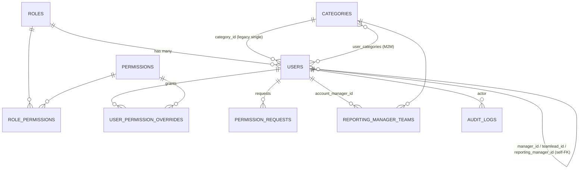
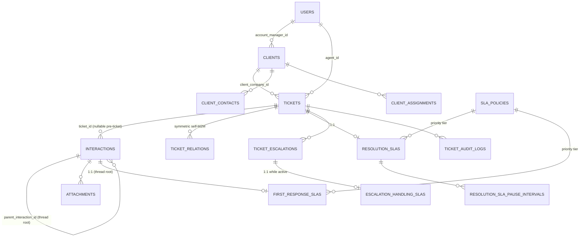
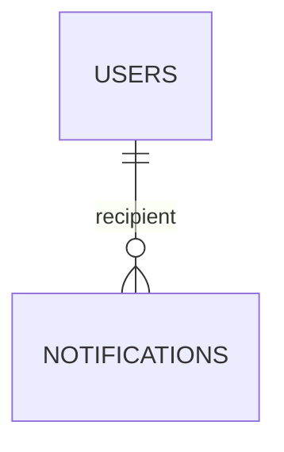

# Entity Relationship Diagram

## Core RBAC entities

## Core ticketing entities

## Notifications

Notes:
- `resolution_slas` and `first_response_slas` are **not** the same clock — see [03-business-workflows/sla](../03-business-workflows/sla/) for why they're modeled as two independent 1:1 relationships (one to `Ticket`, one to the thread-root `Interaction`).
- `Ticket.client_id` (legacy, FK→`users`) and `Ticket.client_company_id` (current, FK→`clients`) coexist — the legacy column reflects an earlier model where a "client" was a `users` row directly; verify which is authoritative before writing new code against either (see [16-known-limitations](../16-known-limitations/README.md) if this hasn't been fully reconciled).
- `ticket_relations` is a **symmetric** self-referencing M2M — a link between ticket A and B is stored as two mirrored rows, not one directional row.
