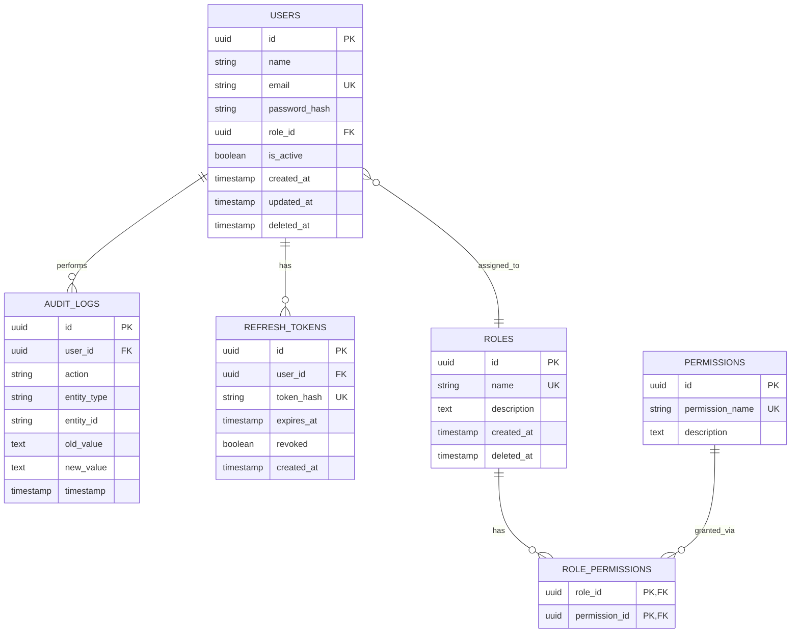
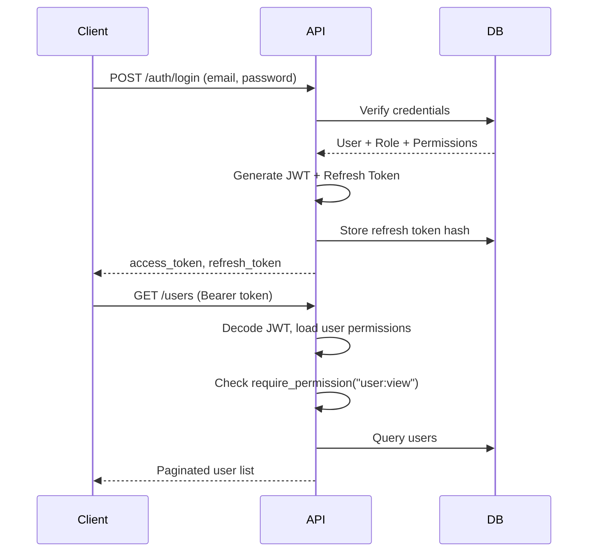

# System Architecture

## High-Level Design

The platform follows **Clean Architecture** with clear separation of concerns:

```
Presentation Layer (API Routes)
        ↓
Service Layer (Business Logic + Audit)
        ↓
Repository Layer (Data Access)
        ↓
Database Layer (PostgreSQL)
```

## Entity Relationship Diagram



## Authentication Flow



## Authorization Engine

Permissions are **database-driven** and never hardcoded in the frontend logic:

1. On login, `/auth/me` returns the user's permission list
2. Frontend stores permissions in Zustand
3. `PermissionGuard` component conditionally renders UI
4. Backend `@require_permission()` enforces API access
5. Mismatch results in **403 Forbidden**

## Audit Logging

All critical actions are logged via `AuditService`:

| Action | Trigger |
|--------|---------|
| user.created | User creation |
| user.updated | User update |
| user.deleted | Soft delete |
| user.login | Successful login |
| user.logout | Logout |
| role.created | Role creation |
| role.updated | Role update |
| role.deleted | Role deletion |
| permission.updated | Role permission change |

## Frontend Architecture

```
src/
├── app/                    # Pages (App Router)
├── components/
│   ├── auth/               # PermissionGuard, AuthGuard
│   ├── layout/             # Dashboard shell, sidebar
│   └── ui/                 # Shadcn components
├── services/               # Axios API layer
├── store/                  # Zustand (auth + theme)
├── providers/              # React Query, theme
├── lib/                    # API client, utils
└── types/                  # TypeScript interfaces
```

## Scalability Considerations

- Stateless API servers (JWT-based auth)
- PostgreSQL with indexed foreign keys
- Repository pattern enables caching layer insertion
- Refresh token table supports token revocation
- Soft delete preserves audit trail integrity
- Modular permission system supports unlimited permissions
