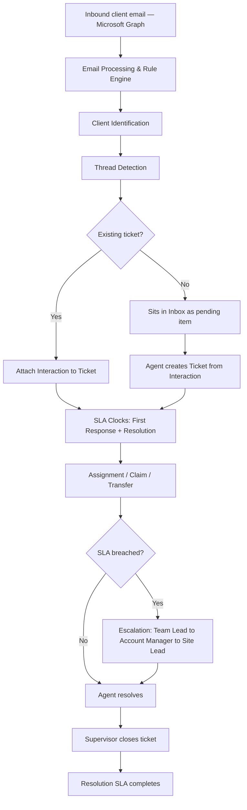

# Unified Ticket Management System (UTMS) — Documentation

This is the production documentation set for UTMS: a combined RBAC (authentication, users, roles, permissions) and support-ticketing platform, served as one FastAPI backend and one Next.js frontend.

**Every claim in this documentation is grounded in the actual code, configuration, and migration history as of 2026-08-21** — not in assumptions about how a system like this "should" work. Where something couldn't be confirmed, it's marked **Not confirmed**. Where a historical design document (root `CLAUDE.md`, `DEPLOYMENT.md`, older `unified-frontend/CLAUDE.md` sections) has drifted from what the code actually does today, that drift is called out explicitly rather than silently repeated — see [16-known-limitations](16-known-limitations/README.md) and the various Known Issues callouts throughout.

## Who should use this, and where to start

| You are... | Start here |
|---|---|
| **A new developer** joining the team | [13-developer-onboarding](13-developer-onboarding/README.md) → [01-project-overview](01-project-overview/README.md) → [03-business-workflows](03-business-workflows/README.md) |
| **A backend developer** working in `unified-backend/` | [05-technical-architecture](05-technical-architecture/README.md) → [06-database](06-database/README.md) → [07-api](07-api/README.md) |
| **A frontend developer** working in `unified-frontend/` | [05-technical-architecture/frontend-architecture.md](05-technical-architecture/frontend-architecture.md) → [04-functional-modules](04-functional-modules/README.md) |
| **Operations / on-call** | [09-deployment](09-deployment/README.md) → [10-operations](10-operations/README.md) → [14-troubleshooting](14-troubleshooting/README.md) |
| **Working on a specific business workflow** (SLA, escalation, ticket lifecycle, mail) | [03-business-workflows](03-business-workflows/README.md) |
| **Evaluating scope / what's built vs. planned** | [01-project-overview/major-capabilities.md](01-project-overview/major-capabilities.md), [16-known-limitations](16-known-limitations/README.md), [17-roadmap](17-roadmap/README.md) |

## Documentation map

```
docs/
├── 01-project-overview/       what the system is, for whom, and why
├── 02-system-architecture/    how the pieces fit together, at a glance
├── 03-business-workflows/     ★ the most important section — traces every
│                              business process end-to-end through the code
├── 04-functional-modules/     one document per product capability
├── 05-technical-architecture/ code layout, layering, technology choices
├── 06-database/               every table, its columns, and why they exist
├── 07-api/                    every endpoint, grouped by domain
├── 08-security/               auth, RBAC enforcement, secrets, PHI/PII
├── 09-deployment/             how this actually gets to production
├── 10-operations/             keeping it running day to day
├── 11-testing/                what's tested, what isn't
├── 13-developer-onboarding/   clone-to-running-locally, step by step
├── 14-troubleshooting/        known problems, symptoms, fixes
├── 15-architecture-decisions/ why the system is shaped the way it is
├── 16-known-limitations/      what doesn't work, and why that's accepted
├── 17-roadmap/                what's planned vs. what's just an idea
├── 18-glossary/               domain terminology
└── 19-release-notes/          what shipped, when
```
(There is no `12-` section — the numbering follows the source specification this documentation set was built against, which skips that number.)

## High-level system workflow

The core business flow this product exists to support — inbound client email through to a closed, SLA-tracked ticket:



Full step-by-step detail, including which service/endpoint/table is involved at each arrow, lives in [03-business-workflows](03-business-workflows/README.md).

## How this documentation should be maintained

- **This is a living document set, not a snapshot.** When a workflow, table, or endpoint changes, update the corresponding file(s) in the same change — don't let docs drift the way `DEPLOYMENT.md` and parts of the sub-project `CLAUDE.md` files have (both explicitly flagged as stale in this pass — see [16-known-limitations](16-known-limitations/README.md) and [14-troubleshooting](14-troubleshooting/README.md)).
- **Verify before trusting.** Any of these files can go stale the same way the ones above did. If something here contradicts the running code, the code is the source of truth — fix the doc, not your understanding.
- **Cross-link, don't duplicate.** If a fact belongs in one place (e.g. a table's columns in [06-database](06-database/README.md)), link to it from elsewhere rather than re-describing it.
- **Mark uncertainty explicitly.** Use "Not confirmed" rather than a confident-sounding guess — this document set treats that distinction as load-bearing.
